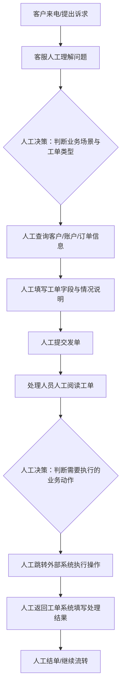
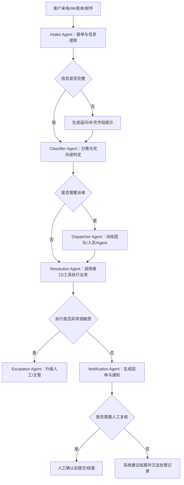

# 工单业务整体流程

## 1. 业务背景

信用卡工单系统是客户问题处理和内部业务协同的核心平台，承担客户诉求接收、问题流转、业务执行、处理结果沉淀等职责。当前系统年处理工单量高，整体流程仍以人工操作为主，典型问题包括复制粘贴多、跨系统跳转多、字段填写依赖经验、处理效率不稳定。

从业务流程上看，工单处理可以分为两个核心环节：

- **发单**：根据客户来电、在线会话或表单内容生成工单，并把问题准确流转到对应处理环节。
- **回单**：处理人员根据工单内容执行实际业务操作，并将处理结果反馈到工单系统完成结单或继续流转。

## 2. 关键角色与责任说明

为了更清晰地体现业务责任，Agent 介入后的流程采用业务型 Agent 划分：

| Agent | 业务定位 | 主要责任 |
|------|----------|----------|
| Intake Agent | 接单/信息提取 | 接收来自电话转写、IM、表单、邮件等渠道的请求，抽取标题、描述、用户、关键字段；信息不足时生成追问 |
| Classifier Agent | 分类与优先级判定 | 判断工单类型、业务场景、优先级和处理路径；采用规则 + LLM 双层策略 |
| Dispatcher Agent | 智能派单 | 根据类型、紧急程度、人员技能、负载或 Agent 能力进行派单；当前作为进阶模块 |
| Resolution Agent | 解决方案/执行 | 查询知识库，调用接口、Mock Tool、MCP 工具或未来 Page Agent 完成业务动作 |
| Notification Agent | 通知与回访 | 生成客户回单、内部状态通知、后续跟进和满意度回访提示 |
| Escalation Agent | 升级/兜底 | 处理字段缺失、工具失败、SLA 风险、合规敏感或复杂争议，转人工或升级主管 |

Agent 介入的目标不是完全取消人工，而是将人工从高频重复操作中解放出来，让人工保留在复核、兜底、合规和例外判断环节。

---

## 3. Agent介入前的整体业务流程

### 3.1 发单流程（人工模式）

1. 客服接听客户来电或查看在线咨询内容，理解客户诉求。
2. 通话结束后，客服手动整理客户信息和沟通内容，例如手机号、姓名、问题描述等。
3. 客服进入工单系统或相关查询系统，检索客户、账户、订单等信息。
4. 客服根据经验判断客户诉求属于哪一类业务场景，并手动选择对应工单类型。
5. 客服将会话内容粘贴到“其他情况说明”等文本字段，并手动填写结构化信息。
6. 客服确认信息无误后提交工单，进入后续处理流程。

### 3.2 回单流程（人工模式）

1. 处理人员打开待处理工单，阅读工单内容并理解客户问题。
2. 处理人员判断该工单需要执行什么业务动作，例如补发优惠券、修改地址、核查账单、排查风险等。
3. 处理人员跳转到一个或多个外部业务系统中进行查询或操作，例如客户信息系统、交易系统、权益系统、风控系统等。
4. 完成业务处理后，处理人员返回工单系统。
5. 处理人员手动填写处理结果、处理说明和结论话术。
6. 确认无误后完成回单并结单，必要时继续流转给下一个处理角色。

### 3.3 介入前的主要痛点

- **处理链路长**：从识别问题到提交/结单，步骤多、切换频繁。
- **人工判断成本高**：工单类型选择、字段填写、结果描述都依赖人工经验。
- **跨系统操作繁琐**：回单时需要在多个业务系统间来回跳转。
- **效率和质量不稳定**：容易出现错选工单、漏填字段、描述不一致等问题。
- **处理时长偏高**：单笔工单通常需要约 1 到 2 分钟，难以支撑更高频率的业务处理。

---

## 4. Agent介入后的整体业务流程

Agent 介入后的目标，不是简单替代某个单点操作，而是把“接单、分类、执行、通知、升级”串成一条可追踪、可复核、可评测的协同链路。

### 4.1 发单流程（Agent辅助/自动化模式）

1. 系统接收客户通话转写、在线会话、表单或邮件内容。
2. **Intake Agent** 整理原始请求，提取客户身份、问题摘要、关键字段和缺失信息。
3. **Classifier Agent** 判断工单类型、业务场景和优先级，给出推荐处理路径。
4. 如果信息不足，**Intake Agent** 生成追问或补充字段提示。
5. 客服或业务人员快速复核自动生成的工单内容，必要时做少量修改。
6. 工单提交后进入处理流程；后续可由 **Dispatcher Agent** 按规则派给团队、人员或 Agent。

### 4.2 回单流程（Agent协同执行模式）

1. 系统读取待处理工单内容、客户上下文和待执行事项。
2. **Classifier Agent** 确认当前工单场景、处理优先级和是否适合自动处理。
3. **Resolution Agent** 选择处理方案，优先调用后端接口或 Mock Tool；后续可接入 MCP 工具或 Page Agent。
4. **Escalation Agent** 贯穿全流程，遇到字段缺失、工具失败、复杂争议、合规敏感或 SLA 风险时自动转人工。
5. **Notification Agent** 根据执行结果生成处理说明、客户回单、内部状态通知和后续跟进提示。
6. 对标准化场景，系统可生成结案建议；对复杂或敏感场景，人工复核后再提交或升级。

### 4.3 Agent介入后的角色分工

- **Intake Agent**：负责接单、文本整理、字段抽取、缺失信息提示。
- **Classifier Agent**：负责工单分类、优先级判定、处理路径建议。
- **Dispatcher Agent**：负责派给人、团队或 Agent；当前作为进阶模块。
- **Resolution Agent**：负责接口调用、Mock Tool 执行、知识库查询、MCP/Page Agent 扩展。
- **Notification Agent**：负责客户回单、内部通知、回访提示。
- **Escalation Agent**：负责异常兜底、人工升级、合规和 SLA 风险处理。

---

## 5. 发单与回单流程图

### 5.1 Agent介入前流程图

### 5.2 Agent介入后流程图

### 5.3 流程图解读

- **介入前**：人工需要自己理解问题、判断场景、选择工单类型、决定处理动作、跨系统执行并撰写结果。
- **介入后**：Agent 负责标准化、重复性和可规则化的处理步骤，人工聚焦复核、异常、合规和复杂判断。
- **关键变化**：系统从“人工串联流程”升级为“Agent 协同处理 + 人工兜底复核”的闭环。

---

## 6. 关键决策责任划分

### 6.1 需要人工决策的节点

- 客户诉求复杂、模糊或存在多重意图，Agent 无法稳定判断时。
- 涉及强合规、高争议或特殊客诉时，例如盗刷疑似、征信异议、投诉升级。
- Agent 识别结果与上下文不一致，或工具执行结果异常时。
- 需要结合经验做例外判断、特殊审批或跨部门协调时。

### 6.2 由Agent进行决策的节点

- Intake Agent 判断输入是否完整，识别缺失字段。
- Classifier Agent 判断客户诉求对应的业务场景、工单类别和优先级。
- Resolution Agent 判断应调用哪类接口、Mock Tool、MCP 工具或知识库能力。
- Notification Agent 根据执行结果生成标准化处理说明和回单话术。
- Escalation Agent 判断是否需要人工接管、升级处理或中断自动流程。

### 6.3 需要人工最终审核的节点

- 发单提交前：确认工单类型、客户信息、问题摘要是否准确。
- 回单结单前：确认工具执行结果、处理结论、回复话术是否可直接对客使用。
- 异常兜底时：确认是否转人工、是否升级处理、是否中断自动流程。

---

## 7. Page Agent 在业务流程中的位置

Page Agent 不进入当前核心主线，但可以作为进阶能力分阶段引入：

1. **前端页面助手**：只操作当前工单详情页，例如填入 AI 回单草稿、检查缺失字段、打开工具面板、滚动到审核区域。
2. **发单/回单表单自动填充**：动态工单表单完善后，把 Intake Agent 的抽取结果转成页面填充动作。
3. **外部遗留系统自动化**：仅当某些行内系统没有 API 时，才考虑 Page Agent Ext / MCP 方案操作浏览器页面；必须具备白名单、脱敏、审计和人工确认。

---

## 8. Agent介入前后业务变化总结

### 8.1 人工职责变化

- **介入前**：人工既要理解问题，也要负责查找页面、填写字段、跨系统执行、撰写结果。
- **介入后**：人工主要承担复核和兜底职责，从“执行者”转变为“审核者”。

### 8.2 业务流程变化

- **介入前**：流程以人工串联为主，系统之间割裂，处理效率受个人熟练度影响明显。
- **介入后**：流程以多 Agent 协同为主，接单、分类、执行、通知、升级形成闭环，人工只在关键节点确认。

### 8.3 业务价值变化

- 将工单处理从“人工重操作”转为“系统自动处理 + 人工复核”。
- 减少复制粘贴、页面跳转和重复填写。
- 提升工单分类准确率和回单表述一致性。
- 压缩单笔处理时长，目标从约 1 到 2 分钟缩短至秒级或分钟级。
- 为后续沉淀标准化流程、评测 Agent 效果、扩展更多业务场景打下基础。

---

## 9. 一句话概括

在 Agent 介入前，工单业务本质上是“人工识别 + 人工操作 + 人工回填”的串行流程；在 Agent 介入后，工单业务将演变为“Intake 接单、Classifier 分诊、Resolution 执行、Notification 通知、Escalation 兜底”的协同闭环流程，从而提升处理效率、标准化水平和风险可控性。
