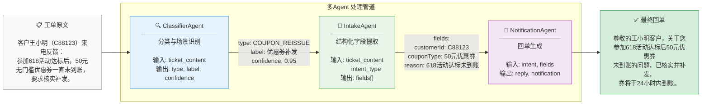
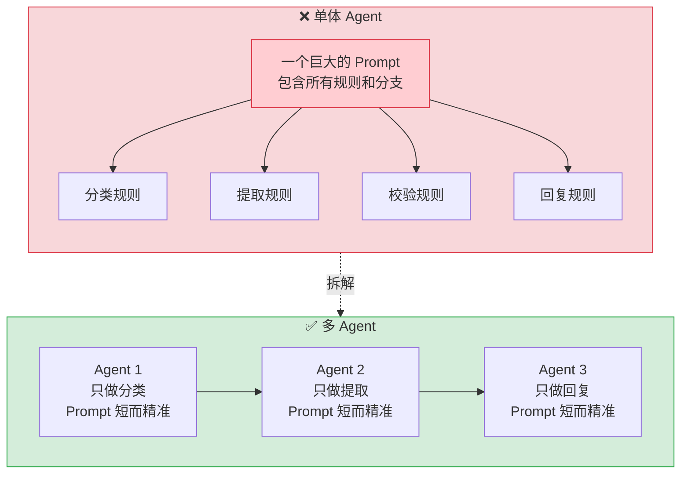
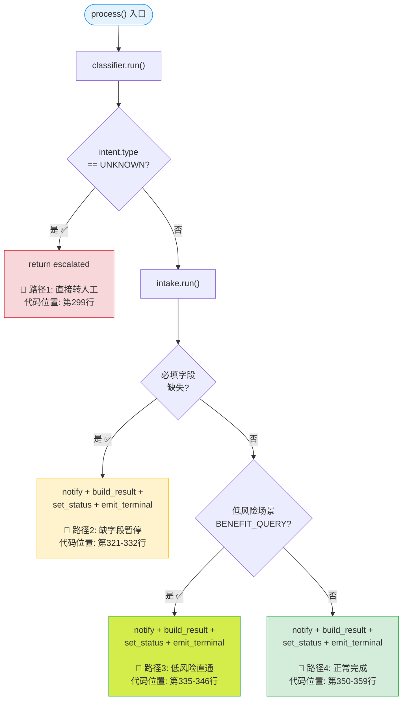
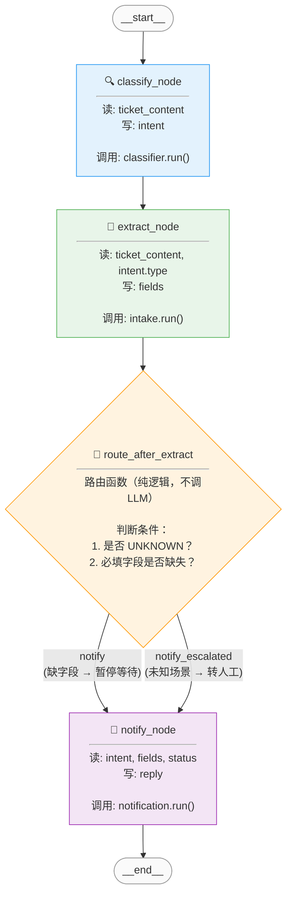
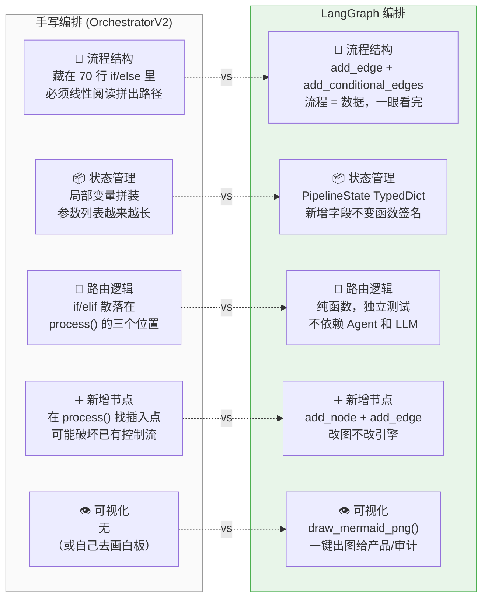
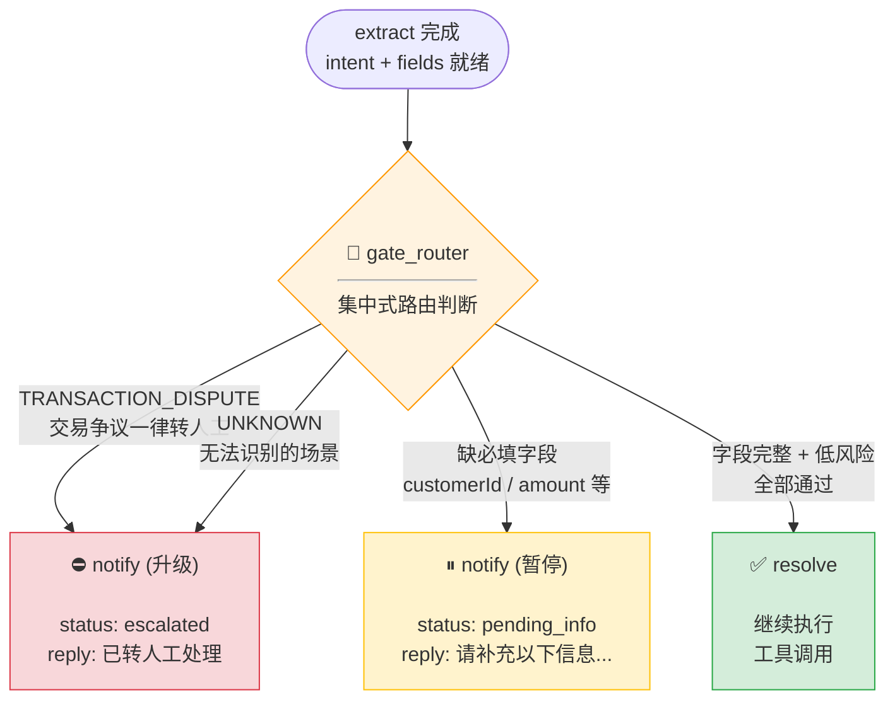
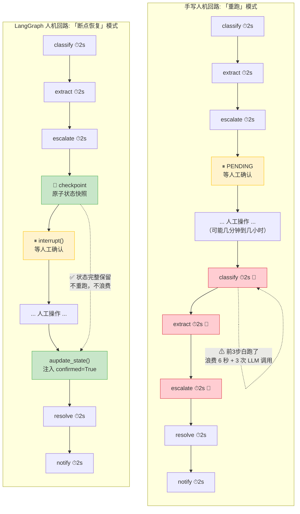
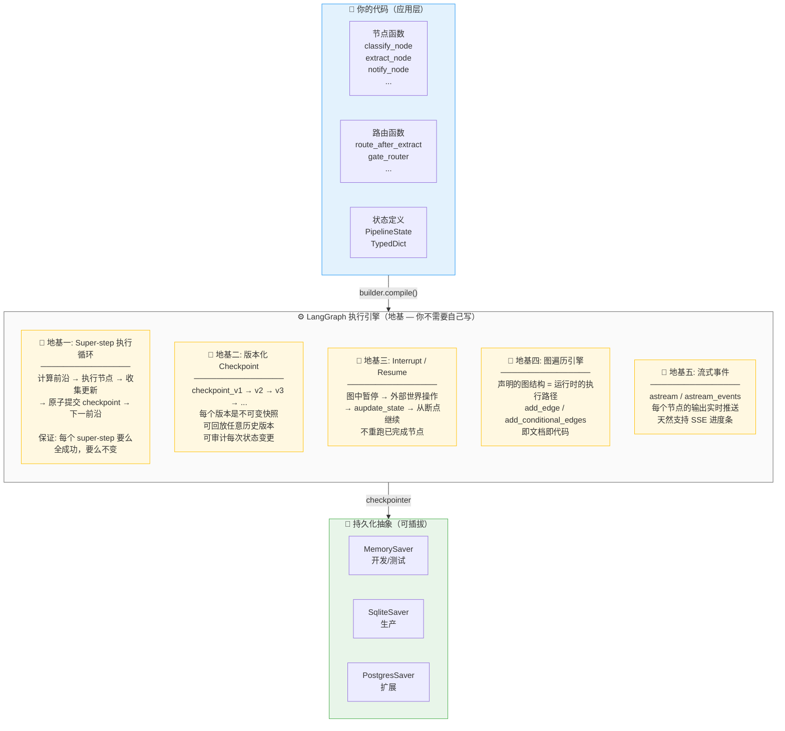

# 多Agent编排快速入门指南

> 一个能跑的例子 > 一堆抽象概念。本文用信用卡工单处理场景，从零开始分别演示手写编排和 LangGraph 编排，帮助你理解两者的核心差异。

---

## 目录

1. [从一个简单场景开始](#一从一个简单场景开始)
2. [手写编排：从零实现](#二手写编排从零实现)
   - [2.1 定义 Agent](#21-定义-agent)
   - [2.2 手写编排器（v1：最简单版本）](#22-手写编排器v1最简单版本)
   - [2.3 手写编排器（v2：加入条件分支）](#23-手写编排器v2加入条件分支)
3. [LangGraph 编排：站在地基上](#三langgraph-编排站在地基上)
   - [3.1 安装](#31-安装)
   - [3.2 定义状态和节点](#32-定义状态和节点)
   - [3.3 手写 vs LangGraph：可视化对比](#33-手写-vs-langgraph可视化对比)
   - [3.4 手写 vs LangGraph 的核心差异](#34-手写-vs-langgraph-的核心差异)
4. [深入：条件分支与门控](#四深入条件分支与门控)
5. [深入：人机回路](#五深入人机回路)
6. [LangGraph 的地基到底是什么](#六langgraph-的地基到底是什么)
7. [选择指南](#七选择指南)

---

## 一、从一个简单场景开始

### 场景描述

信用卡中心每天收到大量工单。一张典型的工单长这样：

```text
客户王小明（客户号 C88123）来电反馈：参加"618年中大促"活动达标后，
50元无门槛优惠券一直未到账，要求核实补发。
```

处理这张工单需要 3 步：

```
[判断是什么诉求] → [抽取关键信息] → [生成回复]
```

我们只处理两种场景：优惠券补发（COUPON_REISSUE）和权益查询（BENEFIT_QUERY），其他情况转人工。

### 为什么需要多Agent？

如果是一个 Agent 处理所有事：

```python
# 反模式：单体 Agent，Prompt 膨胀且不可测试
system_prompt = """你是一个信用卡工单处理专家。
你的任务是：
1. 判断工单属于哪种场景（优惠券补发、权益查询、或其他）...
2. 如果是优惠券补发，抽取客户号、券类型、补发原因...
3. 如果是权益查询，抽取客户号、权益编码、查询原因...
4. 检查必填字段是否完整，不完整要生成追问...
5. 判断风险等级...
6. 如果是低风险且字段完整，直接生成回复...
7. 如果是高风险或字段缺失，生成转人工说明...

（这个 Prompt 会随着场景增加而无限膨胀）
"""
```

**拆成多Agent的好处**：每个 Agent 只做一件事，独立测试、独立优化 Prompt，就像一个流水线——每个工位只拧自己那颗螺丝。

### 业务全景：一张工单的旅程



> **关键观察**：每个 Agent 的输入和输出都是**结构化数据**（dict / TypedDict），不是自然语言。这使得 Agent 之间可以通过字段名精确传递信息，而非依赖 LLM 去"理解"上一段的自然语言输出。

### 单体 vs 多Agent：Prompt 层面的对比



---

## 二、手写编排：从零实现

### 2.1 定义 Agent

首先定义三个 Agent 的基类和实现：

```python
# agents.py
import json
from abc import ABC, abstractmethod
from openai import AsyncOpenAI

# ---------------------------------------------------------------------------
# LLM 客户端（生产环境替换为你的模型配置）
# ---------------------------------------------------------------------------
llm = AsyncOpenAI(base_url="http://localhost:11434/v1", api_key="ollama")


# ---------------------------------------------------------------------------
# Agent 基类
# ---------------------------------------------------------------------------
class BaseAgent(ABC):
    """每个 Agent 接收 dict 输入，返回 dict 输出。无状态。"""

    async def call_llm(self, system_prompt: str, user_prompt: str) -> dict:
        """调 LLM，JSON 模式，一次重试。"""
        for attempt in range(2):
            resp = await llm.chat.completions.create(
                model="gpt-4o-mini",
                messages=[
                    {"role": "system", "content": system_prompt},
                    {"role": "user", "content": user_prompt},
                ],
                response_format={"type": "json_object"},
            )
            try:
                return json.loads(resp.choices[0].message.content)
            except json.JSONDecodeError:
                if attempt == 0:
                    continue
                raise

    @abstractmethod
    async def run(self, input_data: dict) -> dict:
        ...


# ---------------------------------------------------------------------------
# Agent 1: 分类 —— 判断工单属于哪种场景
# ---------------------------------------------------------------------------
class ClassifierAgent(BaseAgent):
    async def run(self, input_data: dict) -> dict:
        content = input_data["ticket_content"]
        if not content:
            return {"type": "UNKNOWN", "label": "未知", "confidence": 0.0}

        result = await self.call_llm(
            """你是信用卡工单分类专家。分析工单内容，判断场景：
1. COUPON_REISSUE - 优惠券补发
2. BENEFIT_QUERY - 权益资格查询
3. UNKNOWN - 以上都不是

返回 JSON: {"type": "...", "label": "中文名", "confidence": 0.0}""",
            f"工单内容：\n{content}",
        )
        return result


# ---------------------------------------------------------------------------
# Agent 2: 提取 —— 根据场景抽取结构化字段
# ---------------------------------------------------------------------------
class IntakeAgent(BaseAgent):
    async def run(self, input_data: dict) -> dict:
        intent_type = input_data["intent_type"]
        content = input_data["ticket_content"]

        field_schemas = {
            "COUPON_REISSUE": ["customerId(客户号)", "couponType(券类型)", "reason(原因)"],
            "BENEFIT_QUERY": ["customerId(客户号)", "benefitCode(权益编码)", "queryReason(查询原因)"],
            "UNKNOWN": ["summary(诉求摘要)"],
        }
        schema = field_schemas.get(intent_type, field_schemas["UNKNOWN"])

        result = await self.call_llm(
            f"""从工单内容中抽取以下字段：{', '.join(schema)}
返回 JSON: {{"fields": [{{"name": "字段名", "value": "值"}}]}}
未找到的字段 value 填 "未提取"。""",
            f"工单内容：\n{content}",
        )
        return result


# ---------------------------------------------------------------------------
# Agent 3: 回复 —— 生成客户回单
# ---------------------------------------------------------------------------
class NotificationAgent(BaseAgent):
    async def run(self, input_data: dict) -> dict:
        intent = input_data["intent"]
        fields = input_data["fields"]

        result = await self.call_llm(
            "你是信用卡客服回复专家。根据处理结果生成专业、简洁的客户回单。返回 JSON: {\"reply\": \"...\"}",
            json.dumps({"场景": intent, "字段": fields}, ensure_ascii=False),
        )
        return result
```

### 2.2 手写编排器（v1：最简单版本）

```python
# orchestrator_handwritten.py
"""
手写编排器 —— 顺序执行 Agent，代码即流程。

优点：零依赖，完全可控。
缺点：路径藏在 if/else 里，读代码 = 在脑子里画图。
"""
import asyncio
from agents import ClassifierAgent, IntakeAgent, NotificationAgent


class Orchestrator:
    def __init__(self):
        self.classifier = ClassifierAgent()
        self.intake = IntakeAgent()
        self.notification = NotificationAgent()

    async def process(self, ticket_content: str) -> dict:
        """处理一张工单。"""
        print("=== 开始处理工单 ===\n")

        # 步骤1：分类
        print("[1/3] 正在判断场景...")
        intent = await self.classifier.run({"ticket_content": ticket_content})
        print(f"  → 识别为: {intent['label']}（置信度 {intent['confidence']:.0%}）\n")

        if intent["type"] == "UNKNOWN":
            return {"status": "escalated", "reply": "该场景暂不支持自动处理，已转人工。"}

        # 步骤2：提取字段
        print("[2/3] 正在抽取字段...")
        fields_result = await self.intake.run({
            "ticket_content": ticket_content,
            "intent_type": intent["type"],
        })
        fields = {f["name"]: f["value"] for f in fields_result.get("fields", [])}
        print(f"  → 抽取到: {fields}\n")

        # 步骤3：生成回复
        print("[3/3] 正在生成回复...")
        reply_result = await self.notification.run({
            "intent": intent,
            "fields": fields_result.get("fields", []),
        })
        print(f"  → 回复: {reply_result['reply']}\n")

        return {
            "status": "completed",
            "intent": intent,
            "fields": fields,
            "reply": reply_result["reply"],
        }


# ---------------------------------------------------------------------------
# 运行
# ---------------------------------------------------------------------------
async def main():
    ticket = "客户王小明（客户号 C88123）来电反馈：参加618活动达标后50元优惠券一直未到账，要求核实补发。"

    orch = Orchestrator()
    result = await orch.process(ticket)
    print("=== 最终结果 ===")
    print(f"状态: {result['status']}")
    print(f"回复: {result['reply']}")


if __name__ == "__main__":
    asyncio.run(main())
```

**运行效果：**

```text
=== 开始处理工单 ===

[1/3] 正在判断场景...
  → 识别为: 优惠券补发（置信度 95%）

[2/3] 正在抽取字段...
  → 抽取到: {'customerId': 'C88123', 'couponType': '50元无门槛优惠券', 'reason': '618活动达标未到账'}

[3/3] 正在生成回复...
  → 回复: 尊敬的王小明客户，关于您参加618活动达标后50元优惠券未到账的问题，已核实并补发，券将于24小时内到账。

=== 最终结果 ===
状态: completed
回复: 尊敬的王小明客户...
```

**到这里，你已经有了一个能跑的多Agent编排。** 但它有一个致命问题：**如果要加一个"检查字段是否完整，不完整就追问"的步骤怎么办？**

### 2.3 手写编排器（v2：加入条件分支）

现在需求升级：优惠券补发必须有 `customerId`、`couponType`、`reason` 三个字段都提取到（不能是"未提取"），否则暂停等客户补充。

```python
# orchestrator_handwritten_v2.py
"""
加入条件分支后，代码开始膨胀。

问题：每加一个分支条件，就多一层 if/else 嵌套。
      执行路径不再一眼可见。
"""
import asyncio
from agents import ClassifierAgent, IntakeAgent, NotificationAgent


class OrchestratorV2:
    def __init__(self):
        self.classifier = ClassifierAgent()
        self.intake = IntakeAgent()
        self.notification = NotificationAgent()

    # 必填字段配置
    REQUIRED_FIELDS = {
        "COUPON_REISSUE": ["customerId", "couponType", "reason"],
        "BENEFIT_QUERY": ["customerId", "benefitCode", "queryReason"],
    }

    async def process(self, ticket_content: str) -> dict:
        print("=== 开始处理工单 ===\n")

        # ------- 步骤1：分类 -------
        intent = await self.classifier.run({"ticket_content": ticket_content})
        print(f"[分类] {intent['label']}（置信度 {intent['confidence']:.0%}）")

        if intent["type"] == "UNKNOWN":
            return {"status": "escalated", "reply": "该场景暂不支持自动处理，已转人工。"}

        # ------- 步骤2：提取 -------
        fields_result = await self.intake.run({
            "ticket_content": ticket_content,
            "intent_type": intent["type"],
        })
        fields = {f["name"]: f["value"] for f in fields_result.get("fields", [])}
        print(f"[提取] {fields}")

        # ------- 步骤3：门控检查 -------
        #
        #  问题从这里开始 —— 条件判断直接写在编排器里。
        #  当你有 700+ 种场景和 5 种暂停条件时，下面的代码会变成什么样？
        #
        required = self.REQUIRED_FIELDS.get(intent["type"], [])
        missing = [
            name for name in required
            if fields.get(name) in ("未提取", "", None)
        ]

        if missing:
            # ---- 分支 A：缺字段 → 暂停 ----
            print(f"[门控] 缺字段: {missing}，暂停等补充")
            reply_result = await self.notification.run({
                "intent": intent,
                "fields": fields_result.get("fields", []),
            })
            return {
                "status": "pending_info",
                "missing_fields": missing,
                "reply": f"请补充以下信息：{', '.join(missing)}。\n\n{reply_result['reply']}",
            }

        # 低风险的简单场景直接通过
        if intent["type"] == "BENEFIT_QUERY":
            # ---- 分支 B：低风险 → 直接生成回复 ----
            reply_result = await self.notification.run({
                "intent": intent,
                "fields": fields_result.get("fields", []),
            })
            return {
                "status": "completed",
                "intent": intent,
                "fields": fields,
                "reply": reply_result["reply"],
            }

        # ---- 分支 C：其他情况 → 正常完成 ----
        # （未来可能在这里插入更多判断）
        reply_result = await self.notification.run({
            "intent": intent,
            "fields": fields_result.get("fields", []),
        })
        return {
            "status": "completed",
            "intent": intent,
            "fields": fields,
            "reply": reply_result["reply"],
        }


async def main():
    # 模拟缺字段的工单
    ticket = "客户来电说优惠券没到账。（没有客户号和券类型信息）"
    orch = OrchestratorV2()
    result = await orch.process(ticket)
    print(f"\n=== 结果 ===\n状态: {result['status']}\n回复: {result['reply']}")

if __name__ == "__main__":
    asyncio.run(main())
```

**这就是手写编排的"不直观"来源**。

把 `process()` 方法里的执行路径画出来，你会看到：



> **问题一目了然**：4 条路径分散在 `process()` 方法的 4 个不同代码位置。任何人（包括一个月后的你自己）要理解"这个工单会走哪些路径"，必须从头到尾读完整段代码，在脑子里画出上面这张图。而每次新增一个条件分支，这张图就多一个分叉，阅读成本成倍增长。

同样的，3 个 Agent、2 个场景、1 个条件分支，代码已经开始看起来像意大利面条。如果你需要：

- 再加一个工具调用步骤
- 再加一个执行后二次检查
- 再加一个中风险人工确认
- 再加一个并行拉取外部数据

**你会发现每次需求变更，都需要在 `process()` 方法里找应该插入的位置，然后小心翼翼不破坏已有的控制流。**

> **手写编排的核心矛盾**：流程结构（"A 之后是 B，如果 X 则 C 否则 D"）和执行逻辑（"怎么调 Agent、怎么推送事件、怎么记录 trace"）被揉在同一个方法里。你读代码时，必须同时在脑子里处理这两层信息。

---

## 三、LangGraph 编排：站在地基上

现在用 LangGraph 重写相同逻辑。你会看到**流程结构和执行逻辑被干净地分开了**。

### 3.1 安装

```bash
pip install langgraph langchain-openai
```

### 3.2 定义状态和节点

```python
# orchestrator_langgraph.py
"""
LangGraph 编排 —— 流程是数据，执行是引擎。

核心概念：
  State（状态）：一张"全局白板"，所有节点读它、写它
  Node（节点）：一个 Python 函数，接收 State，返回 State 的部分更新
  Edge（边）：从节点 A 必须走到节点 B
  Conditional Edge（条件边）：从节点 A 根据条件走到 B、C 或 D
"""
import asyncio
from typing import TypedDict, Optional, Literal
from langgraph.graph import StateGraph, END

# 复用上一节的 Agent
from agents import ClassifierAgent, IntakeAgent, NotificationAgent


# ---------------------------------------------------------------------------
# 1. 定义状态 —— 替代手写编排中散落的局部变量和 dict
# ---------------------------------------------------------------------------
class PipelineState(TypedDict):
    """管道的全局状态。每个节点的返回值会 merge 到这里。"""
    ticket_content: str
    intent: Optional[dict]
    fields: Optional[list[dict]]
    missing_fields: list[str]
    reply: str
    status: str


# ---------------------------------------------------------------------------
# 2. 定义节点 —— 每个节点 = 一个 Agent 的调用
# ---------------------------------------------------------------------------
classifier = ClassifierAgent()
intake_agent = IntakeAgent()
notification = NotificationAgent()

REQUIRED = {
    "COUPON_REISSUE": ["customerId", "couponType", "reason"],
    "BENEFIT_QUERY": ["customerId", "benefitCode", "queryReason"],
}


async def classify_node(state: PipelineState) -> dict:
    """节点：分类"""
    result = await classifier.run({"ticket_content": state["ticket_content"]})
    print(f"[分类] {result['label']}（置信度 {result.get('confidence', 0):.0%}）")
    return {"intent": result}


async def extract_node(state: PipelineState) -> dict:
    """节点：提取字段"""
    result = await intake_agent.run({
        "ticket_content": state["ticket_content"],
        "intent_type": state["intent"]["type"],
    })
    fields = result.get("fields", [])
    print(f"[提取] { {f['name']: f['value'] for f in fields} }")
    return {"fields": fields}


async def notify_node(state: PipelineState) -> dict:
    """节点：生成回复（多个分支共用）"""
    result = await notification.run({
        "intent": state.get("intent", {}),
        "fields": state.get("fields", []),
    })
    print(f"[回复] {result['reply']}")
    return {"reply": result["reply"], "status": state.get("status", "completed")}


# ---------------------------------------------------------------------------
# 3. 定义路由 —— 门控逻辑集中在一个函数里
# ---------------------------------------------------------------------------
def route_after_extract(state: PipelineState) -> Literal["notify", "notify_escalated", END]:
    """条件路由：提取完成后，根据场景和字段完整性决定下一跳。"""
    intent = state.get("intent", {})
    fields_list = state.get("fields", [])

    # 未知场景 → 转人工
    if intent.get("type") == "UNKNOWN":
        return "notify_escalated"

    # 检查必填字段
    fields_dict = {f["name"]: f["value"] for f in fields_list}
    missing = [
        name for name in REQUIRED.get(intent["type"], [])
        if fields_dict.get(name) in ("未提取", "", None)
    ]

    if missing:
        # 缺字段 → 通知并暂停
        print(f"[门控] 缺字段: {missing}")
        # 通过 state 传递额外信息
        state["missing_fields"] = missing
        state["status"] = "pending_info"
        return "notify"

    # 字段完整 → 正常生成回复
    state["status"] = "completed"
    return "notify"


# ---------------------------------------------------------------------------
# 4. 构建图 —— 这就是你的流程文档，一眼看完
# ---------------------------------------------------------------------------
builder = StateGraph(PipelineState)

# 注册节点
builder.add_node("classify", classify_node)
builder.add_node("extract", extract_node)
builder.add_node("notify", notify_node)

# 注册边
builder.set_entry_point("classify")         # 从 classify 开始
builder.add_edge("classify", "extract")     # classify → extract（无条件）
builder.add_conditional_edges(              # extract → ? （有条件）
    "extract",
    route_after_extract,                    # 路由函数
    {
        "notify": "notify",                 # 缺字段 → notify
        "notify_escalated": "notify",       # 未知场景 → notify
    },
)
builder.add_edge("notify", END)             # notify 后结束

# 编译（得到一个可执行的图）
graph = builder.compile()


# ---------------------------------------------------------------------------
# 5. 运行
# ---------------------------------------------------------------------------
async def main():
    # 正常工单
    print("=" * 50)
    print("测试1: 正常工单")
    print("=" * 50)
    result = await graph.ainvoke({
        "ticket_content": "客户王小明（C88123）618活动达标50元优惠券未到账，要求补发。",
    })
    print(f"\n最终: status={result['status']}, reply={result['reply'][:30]}...\n")

    # 缺字段工单
    print("=" * 50)
    print("测试2: 缺字段工单")
    print("=" * 50)
    result = await graph.ainvoke({
        "ticket_content": "客户来电说优惠券没到账。",
    })
    print(f"\n最终: status={result['status']}, missing={result.get('missing_fields')}")


if __name__ == "__main__":
    asyncio.run(main())
```

### 3.3 手写 vs LangGraph：可视化对比

上面的 LangGraph 代码在运行时，图结构是这样的：



**对比手写编排的路径图**，这张图是直接从 `builder.add_node` / `builder.add_edge` 的代码中"生成"的——**图就是代码，代码就是图**。不需要在脑子里翻译。

### 3.4 手写 vs LangGraph 的核心差异

把两份代码并列对比：



---

## 四、深入：条件分支与门控

手写和 LangGraph 在这个维度差异最大。假设你的门控逻辑变成：

```text
extract 执行后，需要判断 4 种路径：

  缺必填字段 → 追问客户 → 暂停
  未知场景   → 生成转人工说明 → 升级
  交易争议   → 强制转人工（无论字段是否完整）→ 升级
  低风险+字段完整 → 继续执行
```

**手写编排**：所有分支写在 `process()` 方法里，或者拆成一个 `_maybe_stop()` 子方法，但**子方法内部仍然是一个大的 if/elif 塔**。

**LangGraph 编排**：路由逻辑是独立函数，图结构一眼可见：

```python
def gate_router(state: PipelineState) -> str:
    """门控路由 —— 可以独立单元测试"""
    intent_type = state["intent"]["type"]
    fields = state["fields"]

    # 规则1：交易争议一律转人工
    if intent_type == "TRANSACTION_DISPUTE":
        state["status"] = "escalated"
        return "notify"

    # 规则2：未知场景
    if intent_type == "UNKNOWN":
        state["status"] = "escalated"
        return "notify"

    # 规则3：必填字段检查
    missing = check_required(intent_type, fields)
    if missing:
        state["status"] = "pending_info"
        state["missing_fields"] = missing
        return "notify"

    # 规则4：通过
    return "proceed"

# 图定义 —— 把上面 4 条规则可视化
builder.add_conditional_edges("escalate", gate_router, {
    "notify": "notify",     # 暂停或升级 → 通知
    "proceed": "resolve",   # 通过 → 继续下一节点
})
```

**关键优势**：`gate_router` 可以独立写单元测试，只测路由规则是否正确，不依赖任何 Agent 或 LLM。

把 4 条分支路径可视化：



> **注意**：图里 `notify` 节点被两条不同颜色的边指向（红色升级路径和黄色暂停路径），但图结构本身没变。区别在于路由函数写入 `state.status` 的值不同，notify 节点读这个值就知道该生成"升级话术"还是"追问话术"。

---

## 五、深入：人机回路

信用卡工单系统最典型的人机回路场景：中风险操作需要人工确认后才能执行。

### 5.1 手写的人机回路

```python
# 你的做法：暂停 → 外部 API 接收确认 → 重新调用 process()
class Orchestrator:
    async def process(self, ticket_id: str, confirmed: bool = False):
        # ... 前面的步骤略 ...

        # 中风险检查
        if risk_level == "medium" and not confirmed:
            # 暂停，等人工确认
            return {"status": "pending_human_confirm", ...}

        # 如果 confirmed=True，从这里继续
        await execute_tool(...)
        await generate_reply(...)

# API 层
@router.post("/confirm")
async def confirm(ticket_id: str):
    # 重新调 process，从头跑一遍 classify + extract + escalate...
    return await orchestrator.process(ticket_id, confirmed=True)
```

**问题**：`confirmed=True` 后，classify、extract、escalate 三个 Agent **全部重新执行**。3 个 LLM 调用白跑了。

### 5.2 LangGraph 的人机回路

LangGraph 的 checkpoint 机制让恢复**不重跑已完成节点**：

```python
from langgraph.checkpoint.memory import MemorySaver

# 编译时指定 checkpointer
graph = builder.compile(checkpointer=MemorySaver())

# 第一次执行：跑到 escalate 节点会暂停
config = {"configurable": {"thread_id": ticket_id}}

# 在 escalate_node 里调用 interrupt()
async def escalate_node(state: PipelineState) -> dict:
    if state["risk_level"] == "medium" and not state.get("confirmed"):
        from langgraph.types import interrupt
        interrupt("需要人工确认")  # ← 暂停在这里，前面的状态已 checkpoint
    # ...

# API 层：确认后从断点恢复
@router.post("/confirm")
async def confirm(ticket_id: str):
    config = {"configurable": {"thread_id": ticket_id}}
    # 更新状态（注入 confirmed=True），不重新跑 classify/extract
    await graph.aupdate_state(config, {"confirmed": True})
    # None = 不传新 input，从断点继续
    return await graph.ainvoke(None, config)
```



**这不是"换个写法"——这是用或不用的架构差异。** 当你的 Agent 从 3 个变 5 个、LLM 调用从 2 秒变 5 秒时，这个差异就是 20 秒的等待和 10 秒的等待的区别。

---

## 六、LangGraph 的地基到底是什么

经过上面 4 个渐进式例子，我们可以总结 LangGraph 提供的**地基**了：

### 地基一：Super-step（超步）执行语义

```text
手写：await A; await B; await C
      → 调用顺序 = 代码行号，状态边执行边散落

LangGraph：每个 super-step 内：
  1. 计算"前沿"（哪些节点该执行）
  2. 执行前沿上的节点
  3. 收集状态更新
  4. 原子提交 checkpoint（全成功 or 不变）
  5. 计算下一个前沿
```

### 地基二：版本化的状态检查点

```text
手写：ticket.status = "in_progress"  →  旧状态被覆盖

LangGraph：checkpoint_v1 → checkpoint_v2 → checkpoint_v3
          每个版本都是不可变快照，可回放、可审计
```

### 地基三：中断与恢复

```text
手写：暂停 → 外部 API 接收确认 → 重新调 process() → 重跑已完成步骤

LangGraph：interrupt() → aupdate_state() → ainvoke(None) → 从断点继续
```

### 地基四：图遍历引擎

```text
手写：代码的顺序 = 执行的顺序（你必须按行号推导）

LangGraph：图结构是数据，执行引擎遍历它
          add_edge + add_conditional_edges 声明的图和实际运行是一致的
```

### 地基五：流式事件

```text
手写：你需要手写 asyncio.Queue + SSE 格式化

LangGraph：graph.astream() / astream_events() 内置
          自定义事件格式需要适配，但底层机制已提供
```

### LangGraph 分层架构总览



### 一句话总结

> **LangGraph 做的事情 = 把"代码即流程"变成"数据即流程"——图是声明的、引擎是标准的、状态是可恢复的。你的工作从"写流程引擎"变成了"配置节点和边"。**

---

## 七、选择指南

| 场景 | 推荐方案 | 原因 |
|---|---|---|
| POC / 原型验证（3-5 Agent，简单线形） | **手写** | 0 依赖，快速出效果，流程简单不需要引擎 |
| 试点阶段（5-10 Agent，有条件分支） | **手写 + 显式管道定义** | 把流程结构从代码中抽成数据，为 LangGraph 铺路 |
| 生产阶段（10+ Agent，多分支、有人机回路） | **LangGraph** | checkpoint、interrupt、并行这些地基能力直接可用 |
| 需要向非技术方展示流程 | **LangGraph** | `draw_mermaid_png()` 一键出图，比任何文档都直观 |
| 金融/合规强审计场景 | **LangGraph** | 每个 super-step 后的原子 checkpoint = 天然审计轨迹 |
| 团队超过 3 人同时改编排逻辑 | **LangGraph** | 标准化的图定义 = 共同语言，减少沟通成本 |

**不要同时做两件事**：不要一边学 LangGraph 一边验证业务逻辑。先用最简单的方式跑通，再引入框架解决复杂度问题。

---

## 附录：运行本文代码的最低环境

```bash
pip install langgraph langchain-openai
```

将 `agents.py`、`orchestrator_handwritten.py`、`orchestrator_langgraph.py` 放在同一目录，修改 `BaseAgent.call_llm` 中的 LLM 配置后直接运行即可。
