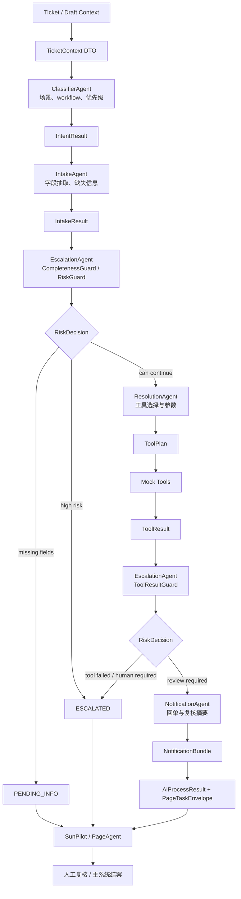
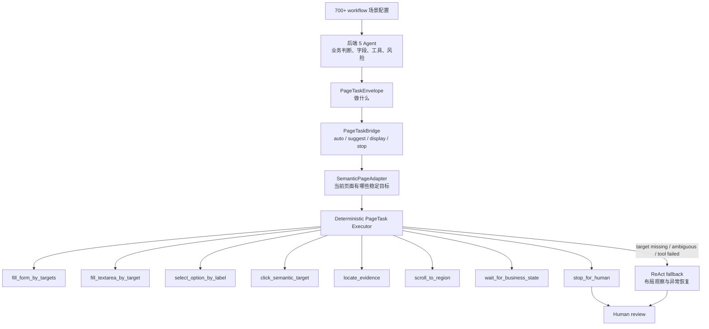
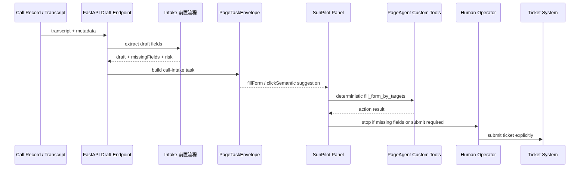
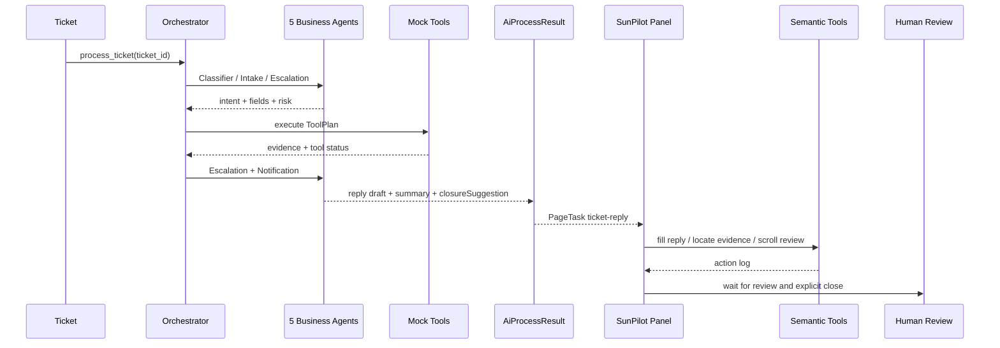

# TicketAgent 架构与验收链路（2026-07-23）

本文用于承接 `PLAN1.md` 的“文档与答辩口径”阶段，重点回答三个问题：

- 多 Agent 为什么保留 5 个，而不是继续拆分或合并。
- Agent 之间的数据如何按契约传递，避免裸 dict 漂移。
- PageAgent/SunPilot 如何适配 700+ 发回单场景，而不是编码 700+ 套前端业务规则。

## 总体结论

TicketAgent 的可扩展边界应固定为：

```text
业务差异：后端 Agent / workflow_config
任务协议：PageTaskEnvelope
页面能力：SemanticPageAdapter + deterministic custom tools
异常恢复：ReAct fallback
人工边界：保存、提交、结案、转派必须由人工或主系统显式触发
```

PageAgent 不是第六个后端业务 Agent，也不是业务规则引擎。它是 SunPilot 面板中的前端受控执行层，只根据后端给出的 `PageTaskEnvelope` 去调用白名单页面能力。

## 多 Agent 编排图



### Agent 保留口径

| Agent | 保留原因 | 不再拆分的边界 |
|---|---|---|
| `ClassifierAgent` | 决定场景、workflow 与优先级，是后续规则路由入口。 | 不拆 `IntentAgent`，避免分类口径重复。 |
| `IntakeAgent` | 抽取字段与识别缺失信息，是发单和回单的结构化入口。 | 通话发单作为 Intake 前置子流程，不新增业务 Agent。 |
| `ResolutionAgent` | 选择 Mock Tool、生成工具参数、整理证据。 | 不拆 `ToolAgent`，工具调用属于解决方案执行。 |
| `EscalationAgent` | 统一处理缺字段、风险、工具失败和人工门禁。 | 内部 guard 可拆模块，但不注册成新 Agent。 |
| `NotificationAgent` | 生成客户回单、内部通知、复核摘要和结案建议。 | 不让它直接结案，只输出 `closureSuggestion.canClose`。 |

## 数据契约图

```mermaid
flowchart LR
    DB["Database snake_case"] --> REPO["Repository / Pydantic 边界"]
    REPO --> DTO["Agent DTOs"]
    DTO --> CARD["AgentCard schema validation"]
    CARD --> AGENT["Agent.run(input)"]
    AGENT --> OUT["Agent output"]
    OUT --> CARD2["AgentCard schema validation"]
    CARD2 --> CTX["PipelineContext"]
    CTX --> API["API response camelCase"]
    API --> UI["Frontend types"]
    UI --> PT["PageTaskEnvelope"]
    PT --> TOOLS["Semantic tools"]
```



### 字段规范

| 层 | 命名 | 说明 |
|---|---|---|
| 数据库 | `snake_case` | 表字段、审计列、Repository 查询结果。 |
| Python DTO | `snake_case` 为主，输出时按 API 转换 | `TicketContext`、`IntakeResult`、`RiskDecision`、`ToolPlan` 等。 |
| API / 前端 | `camelCase` | `AiProcessResult`、`PageTaskEnvelope`、`TicketDraftResult`。 |
| PageAgent tool input | `camelCase` | 贴近前端 TypeScript 和页面语义 target。 |

### 契约守护点

- `Orchestrator._run_agent_step()` 在 Agent 执行前校验 input，执行后校验 output。
- `agent_contracts.py` 负责 Orchestrator-to-Agent payload 的构造和运行时归一化。
- `workflow.py` 负责 `workflow_config.json` 的结构化读取和访问器收口。
- `smoke_module_p_agent_contracts.py` 覆盖 DTO、schema、字段边界和枚举漂移。
- `smoke_module_p_workflow_contracts.py` 覆盖 workflow 场景枚举、推荐工具、必填字段和发单 PageTask。
- `smoke_module_p_architecture_guardrails.py` 守住 5 Agent 注册、旧 shim 不进主链路、前端 AI 入口不外溢。

## PageAgent 适配 700+ 场景



### 为什么不用为 700+ 场景分别写前端流程

700+ 场景的差异通常是：

- 需要哪些字段；
- 如何判断风险；
- 调哪个 Mock Tool；
- 回单模板如何组织；
- 哪些场景只能建议，不能自动执行。

这些属于业务决策，应该留在后端 Agent 与 `workflow_config`。前端只需要稳定表达页面能力，例如“填草稿字段”“填回单正文”“定位证据”“滚到人工确认区”“停止等待人工”。只要新场景仍落在这些页面能力内，就不需要新增前端业务流程函数。

只有当出现新的页面类型或新的页面能力时，才扩展 `SemanticPageAdapter` 或 custom tool。例如从企业壳扩展到外部核心系统页面时，可以新增一组页面 target；但仍不把每个业务场景写成一套 DOM 操作脚本。

## 发单数据流



发单侧的关键边界：

- `pageTaskHints` 可以继续兼容旧 UI，但主协议应以 `pageTask` 为准。
- 缺字段时 `requiresHumanBeforeSubmit=true`，PageAgent 只能填草稿和提示人工。
- 提交工单属于人工或主系统动作，不允许 PageAgent 绕过确认。

## 回单数据流



回单侧的关键边界：

- `NotificationAgent` 只能生成建议，不能修改主系统状态。
- 低风险也进入 `pending_human_review`，由人工复核后调用结案接口。
- 高风险、缺字段、工具失败只允许定位原因和准备人工处理，不允许保存或结案。

## 风险门禁链路

| 链路 | 预期状态 | PageTask mode | PageAgent 能做什么 | 不允许做什么 |
|---|---|---|---|---|
| 低风险完整字段 | `pending_human_review` | `suggest` 或 `display` | 填回单草稿、定位证据、滚到复核区。 | 直接结案。 |
| 中风险需确认 | `pending_human_confirm` | `stop` 或 `suggest` | 展示确认原因、定位证据、停止等待人工。 | 自动继续工具或提交。 |
| 高风险 | `escalated` | `stop` | 定位风险说明，提示人工接管。 | 保存、结案、转派。 |
| 工具失败 | `escalated` 或 `failed` | `stop` | 展示失败原因、定位工具日志。 | 伪造证据或覆盖失败状态。 |
| 缺字段 | `pending_info` | `stop` 或 `suggest` | 填已知字段、提示缺失字段。 | 提交工单或继续工具调用。 |

## 验收链路

### 1. 架构守护

```powershell
.venv\Scripts\python.exe ai-engine\evaluation\smoke_module_p_architecture_guardrails.py
.venv\Scripts\python.exe ai-engine\evaluation\smoke_module_p_agent_contracts.py
.venv\Scripts\python.exe ai-engine\evaluation\smoke_module_p_workflow_contracts.py
```

验收点：

- 注册表只暴露 5 个业务 Agent。
- Orchestrator 主链路只按 5 Agent 接线。
- DTO 与 AgentCard schema 能拦截缺字段、类型错误和枚举漂移。
- `workflow_config` 场景枚举与 Classifier output enum 一致。
- 前端 Header 和 legacy wrapper 不重新出现 SunPilot 外 AI 入口。

### 2. 低风险回单

```powershell
.venv\Scripts\python.exe ai-engine\evaluation\smoke_module_d.py
.venv\Scripts\python.exe ai-engine\evaluation\smoke_module_o_tool_calling.py
```

验收点：

- 分类、抽取、工具调用、通知生成链路完整。
- Mock Tool 证据进入结果快照。
- 最终只产生结案建议和复核状态，不直接结案。
- 回单侧 `AiProcessResult.pageTask` 可驱动 SunPilot 填草稿和定位证据。

### 3. 发单侧草稿

```powershell
.venv\Scripts\python.exe ai-engine\evaluation\smoke_module_m_call_intake.py
```

验收点：

- 通话记录可生成标准草稿。
- 旧枚举漂移不再进入主链路。
- 发单侧 PageTask 至少包含 `fillForm` 和 `clickSemantic` 能力动作。
- 缺字段时必须停在人工作业点。

### 4. 前端 SunPilot 与 PageAgent

```powershell
cd frontend
npm.cmd run smoke:page-agent
npm.cmd run build
```

验收点：

- PageTask mode、scene、action 枚举覆盖完整。
- deterministic executor 存在且优先于 ReAct fallback。
- 危险点击目标被门禁阻断。
- AI 相关按钮集中到 SunPilot，Header 和旧助手不再暴露重复入口。
- PageAgent deterministic executor 会通过 `page_action_logs` 上报确定性动作审计。
- TypeScript 构建通过。

### 5. 数据治理与审计

```powershell
.venv\Scripts\python.exe ai-engine\evaluation\smoke_module_i1_database.py
```

验收点：

- `call_records`、`ticket_drafts`、`page_action_logs`、`agent_execution_log` 表存在。
- `trace_steps` 具备 `input_json`、`output_json`、`error_message`、`duration_ms` 扩展列。
- 通话记录、发单草稿、PageAgent 操作、Agent 执行日志和 trace 扩展字段均可写入并查询。
- `tool_call_log` 仍作为工具审计权威表，`mock_tool_history` 只承担 Mock 幂等历史。

## 数据治理落地项

数据库治理已在用户确认 schema 变更后执行，涉及：

- 新增 `call_records`；
- 新增 `ticket_drafts`；
- 新增 `page_action_logs`；
- 新增 `agent_execution_log`；
- 扩展 `trace_steps`；
- Repository 写入 Agent 输入输出、PageAgent 操作日志、草稿确认记录。

Repository upsert 已避免 `VALUES(col)` 语法，`smoke_module_i1_database.py` 复跑通过且不再输出该未来弃用 warning。
