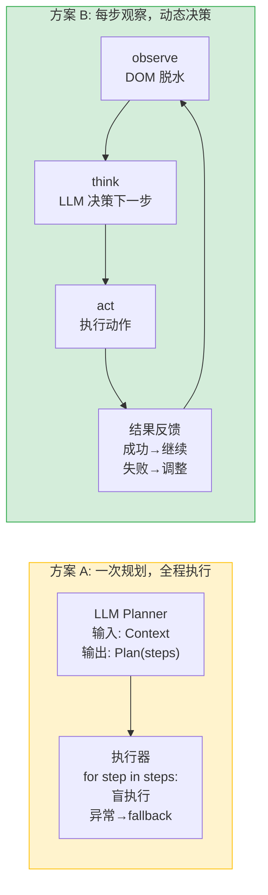

# PageAgent 方案对比：内置 LLM Planner vs fork 源码

> 2026-07-22

---

## 一、两种方案

### 方案 A：内置 LLM Planner（原 O4 方案）

自己实现三层架构：LLM Planner（后端 `/api/page-agent/plan`）→ Policy Guard（校验）→ PageActionRunner（执行）。

```text
坐席指令 → POST /api/page-agent/plan
           → 后端 LLM 根据 PageBusinessContext 生成 PageTaskPlan
           → Policy Guard 校验（白名单、风险、target 合法性）
           → 前端 PageActionRunner 顺序执行 steps[]
           → 每步: byTarget 定位 → SimulatorMask 动画 → setFieldValue/click
```

### 方案 B：fork Ali page-agent 源码（当前方案）

复制上游 PageAgentCore + PageController，用 SSE bridge 连接后端数据。

```text
坐席指令 → agent.execute("任务描述")
           → PageAgentCore ReAct 循环（每步 observe→think→act）
           → 后端数据通过 bridge → pushObservation → LLM 自主决策
```

---

## 二、逐维对比

| 维度 | 方案 A（内置 Planner） | 方案 B（fork 源码） |
|---|---|---|
| **LLM 决策方式** | 一次调用，生成完整 `PageTaskPlan`（steps 列表） | ReAct 循环：每步调 LLM，observation → evaluation → memory → next_goal → action |
| **LLM 调用次数** | 1 次/任务 | 5-10 次/任务（每步 1 次） |
| **计划灵活性** | 静态——计划生成后不变，除非异常触发 fallback | 动态——每步基于最新页面状态重新决策，自动调整 |
| **页面感知** | 无——LLM 看不到 DOM，只看到 `PageBusinessContext` | 每步 `getBrowserState()` 重新扫描 DOM 脱水为文本 |
| **需要自研的代码** | Planner 接口（~100行 Python）+ Policy Guard（~200行 TS）+ PageActionRunner（已有 160行）= ~460 行 | Vue Panel（~150行）+ bridge（~40行）+ 工厂函数（~30行）+ LLM proxy（~20行）= ~240 行 |
| **需要引入的外部代码** | 无（SimulatorMask 已复刻） | 上游 22 个源文件（~5100 行），99% 不修改 |
| **调试难度** | 高——LLM 生成的 plan 是黑盒，计划不合理时很难定位是 Planner 的问题还是 Guard 太严 | 中——LLM 每步的思考过程可见（evaluation/memory/next_goal），Panel 实时展示 |
| **异常恢复** | Planner 只生成一次计划，遇到异常回退到硬编码 fallback | 原生支持——工具失败时 LLM 观察到错误，自动尝试替代方案 |
| **DOM 变化适应** | 无力——Vue 重渲染导致 index 漂移时计划完全失效 | 天然——每步重新 observe，自动适应页面变化 |
| **700+ 场景泛化** | 弱——每个新场景可能需要更新 `PageBusinessContext` 和 Prompt | 强——LLM 自己看 DOM、自己理解页面语义、自己适应 |
| **延迟** | 首次调用 2-3s（一次 LLM），执行 ~400ms/step | 每步 2-5s（每次调 LLM），5 步任务约 15-25s |
| **LLM 成本** | 低（1 次调用/任务） | 高（5-10 次调用/任务） |
| **确定性** | 高——同输入→同计划（LLM temperature=0 时） | 低——每步观察结果不同，可能导致不同路径 |
| **答辩叙事** | "我们自研了一个 LLM Planner，把业务上下文转成页面操作计划，用 Policy Guard 保证安全" | "我们深入研究了阿里 page-agent 的 ReAct 架构，裁剪其核心引擎，用 observation 机制连接业务 Agent 和页面 Agent" |
| **安全性** | 可以做到每步硬约束（Policy Guard 拦截） | MVP 不做——LLM 输出直接执行。后续可通过 customTools 或修改 tools/index.ts 加入拦截 |
| **演示可控性** | 高——计划是确定性的，每次执行一样 | 中——LLM 可能走不同路径，需要多次排练确保稳定 |

---

## 三、核心差异：决策模型



方案 A 的本质是**离线规划 + 在线盲执行**——LLM 在看不到页面的情况下做决策，执行器在看不到上下文的情况下按计划跑。

方案 B 的本质是**在线感知 + 动态决策**——每一步都基于最新的页面状态重新思考。

---

## 四、选择理由

| 选择方案 B 的核心原因 |
|---|
| fork 源码后，方案 B 只需写 ~240 行新代码，方案 A 需要写 ~460 行，且 Planner 和 Guard 都是最容易出 bug 的部分 |
| 方案 A 的 LLM Planner 看不到 DOM——它只能根据 `PageBusinessContext` 的寥寥几个字段（ticketStatus、missingFields、availableActions）猜测页面状态，这和 Ali page-agent 原生的 DOM 脱水相比是"蒙眼决策" |
| 方案 B 的异常恢复是原生的——工具失败后 LLM 自动看到错误并调整，方案 A 需要单独写 fallback 逻辑 |
| 方案 A 在 700+ 场景下需要不断扩充 `PageBusinessContext` 和 Prompt，方案 B 让 LLM 自己看页面自己适应 |
| 方案 B 的每步思考过程在 Panel 中可见——对答辩演示来说，这比"一次生成计划然后机械执行"更有展示力 |

**方案 A 本应是方案 B 的上层建筑**——等 MVP 跑通后，可以在 PageAgentCore 外围加 Policy Guard 做硬约束，而不是一开始就自研一个简化的 Planner 替代它。

---

## 五、结论

```text
方案 A（自研 Planner）: 可以做到更安全、更确定，但需要更多代码，
                      且失去了 page-agent "实时观察页面"的核心优势。

方案 B（fork 源码）:  更少的自研代码，更强的泛化能力，更生动的演示效果。
                     代价是每次任务 LLM 调用更多，且 MVP 没有安全层。

MVP 选 B。安全层和 Policy Guard 是下一阶段的事——在方案 B 的 ReAct 循环
之上叠加，而不是替代它。
```
