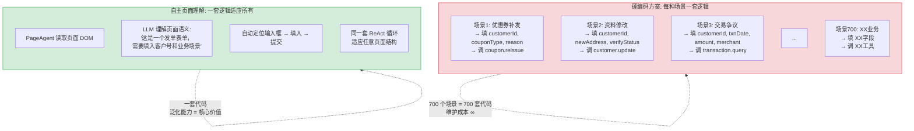
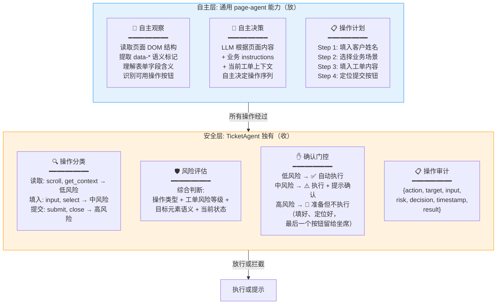
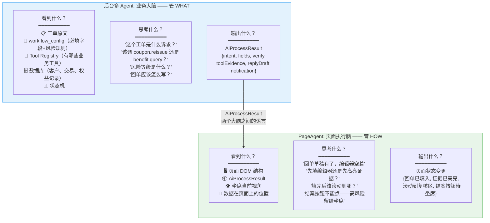
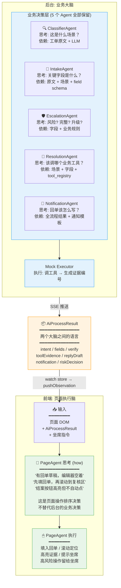

# PageAgent 进阶方案分析：自主页面理解 + 分层安全

> 核心问题：面对 700+ 类工单场景，能否让 PageAgent 自动读取页面形态和信息，自主决策操作序列，而不是为每类场景硬编码处理流程？

---

## 一、范式转变：从 curated tools 到 autonomous understanding

### 1.1 两种范式

```text
范式 A: curated tools（预定义工具集）
┌─────────────────────────────────────────────┐
│  预定义 6 个业务工具                          │
│  Policy Layer 白名单控制                      │
│  LLM 只能在预定义的工具集中选择                 │
│                                             │
│  适合: 场景固定、流程已知                      │
│  问题: 面对 700+ 异构场景，6 个工具兜不住       │
│        每加一个场景 = 加一套工具 = 改代码       │
└─────────────────────────────────────────────┘

范式 B: autonomous page understanding（自主页面理解）
┌─────────────────────────────────────────────┐
│  PageAgent 自动读取页面 DOM                    │
│  LLM 理解页面结构和业务含义                     │
│  自主决策: 该点什么、该填什么、该跳转到哪         │
│                                             │
│  适合: 700+ 异构场景，无法预定义流程             │
│  核心: 一套 ReAct 循环适应任意页面               │
│  风险: LLM 可能误判、误操作                     │
└─────────────────────────────────────────────┘
```

### 1.2 为什么 700+ 场景下范式 B 是正确的



**核心理念**：与其为 700+ 场景各写一套填单规则，不如让 AI 自己看页面、自己理解、自己操作。这正是 Ali page-agent 的设计初衷——通用网页 GUI Agent 不需要提前知道页面长什么样。

---

## 二、技术可行性：Ali page-agent 的原生支持

### 2.1 ReAct 循环天然不依赖页面预设

```typescript
// page-agent 核心循环（PageAgentCore.ts，简化）
// 关键：这个循环不需要预先知道页面结构

while (step < maxSteps) {
    // ── 1. observe: DOM 脱水 → 纯文本索引列表 ──
    const browserState = await this.pageController.getBrowserState()
    // 输出（LLM 看到的）:
    //   [1] button '新建工单'
    //   [2] input '客户号' value=''
    //   [3] select '业务场景' options=['优惠券补发','资料修改','交易争议',...]
    //   [4] textarea '工单内容' value=''
    //   [5] button '提交工单'
    //   ...

    // ── 2. think: LLM 看到 DOM 文本 + 任务描述 → 自主决策 ──
    const result = await this.#llm.invoke(messages, macroTool)
    // LLM 自主输出:
    // {
    //   evaluation_previous_goal: "上一步打开了表单，成功",
    //   memory: "这是一个发单表单，需要填入客户号和场景",
    //   next_goal: "填入客户号 C88123",
    //   action: { input_text: { index: 2, text: "C88123" } }
    // }

    // ── 3. act: 执行工具 → 页面变化 → 下一轮循环重新观察 ──
    await executeAction(result.action)
}
```

**关键点**：LLM 在每一步都重新观察 DOM，所以即使页面因为 Vue 重渲染导致元素 index 变化，LLM 也能在下一轮通过文本描述（"客户号输入框"）重新定位。

### 2.2 语义标记提升理解准确率

TicketAgent 的 Vue SPA 页面是可控的，可以加 `data-*` 语义属性。这些属性会被 page-agent 的 DOM 脱水引擎捕获到 LLM 的上下文中：

```html
<!-- 增强前: LLM 只看到 index -->
<!-- LLM 眼中: [2] input type='text' -->

<!-- 增强后: 加 data-* 语义标记 -->
<form data-section="ticket-issue">
  <label data-field="customerName">客户姓名</label>
  <input
    data-field="customerName"
    data-required="true"
    data-hint="客户唯一标识，如 C88123"
    placeholder="请输入客户号"
  />

  <label data-field="scene">业务场景</label>
  <select data-field="scene">
    <option data-scene="COUPON_REISSUE">优惠券补发</option>
    <option data-scene="ADDRESS_UPDATE">资料修改</option>
    <option data-scene="TRANSACTION_DISPUTE">交易争议</option>
    ...
  </select>

  <button data-action="submit" data-risk="high">提交工单</button>
</form>
```

```text
DOM 脱水后 LLM 看到的内容:

[section: ticket-issue] 发单表单
  [field: customerName] 客户姓名 (必填)
    提示: 客户唯一标识，如 C88123
    当前值: (空)
  [field: scene] 业务场景 (必填)
    可选值: 优惠券补发 | 资料修改 | 交易争议 | ...
    当前值: (未选择)
  [action: submit] 提交工单 ⚠️高风险操作

比"第2个input"强了一个数量级。
```

### 2.3 难度拆解

| 任务 | 难度 | 7.23 前可完成 | 说明 |
|---|---|---|---|
| **page-agent 核心循环裁剪** | ⭐⭐ 中 | ✅ 可完成 | PageAgentCore ~660 行 + LLM 客户端 + 类型定义 |
| **DOM 脱水引擎适配 Vue SPA** | ⭐⭐ 中 | ✅ 可完成 | `getBrowserState()` 需正确提取 Vue 渲染后的 DOM |
| **页面元素语义标记** | ⭐ 低 | ✅ 可完成 | 在关键元素上加 `data-field`、`data-action`、`data-section` |
| **SimulatorMask 鼠标动画** | ⭐ 低 | ✅ 可完成 | page-agent 已有，直接裁剪 |
| **Panel 对话界面** | ⭐⭐ 中 | ✅ 可完成 | 裁剪原 Panel + 改造为 Vue 组件 |
| **LLM 理解多场景页面** | ⭐⭐⭐ 中高 | ⚠️ 可做 2-3 个场景 demo，证明泛化能力 | 需要每类场景的表单有稳定的语义标记 + Prompt 调优 |
| **安全层：风险分级 + 确认门控** | ⭐⭐⭐ 中高 | ⚠️ 可做基础版本 | 按操作类型分级，提交类操作留给坐席 |
| **真正的 700+ 场景覆盖** | ⭐⭐⭐⭐⭐ 极高 | ❌ 不在 7.23 范围 | 需要大量页面标记 + Prompt 工程 + 充分测试 |

---

## 三、核心方案：自主层 + 安全层分层架构

### 3.1 总体架构



### 3.2 分层设计原则

```text
放: PageAgent 在低风险区域充分发挥自主性
   - 读取页面: 无限制，看得越多理解越准
   - 填入表单: 自主识别输入框 → 自动填入 → 高亮已填字段
   - 滚动定位: 自主滚动到目标区域
   - 多步操作链: 自主决策"先填A再填B最后到C"

收: 在高风险边界设置硬约束
   - 提交按钮: PageAgent 可以定位、高亮，但不自动点击
   - 结案按钮: PageAgent 可以填入回单、滚动到位，但结案由坐席操作
   - 状态变更: 一律需要确认
   - 跨页跳转: 需要坐席确认目标页面
```

### 3.3 安全层核心代码

```typescript
// frontend/src/page-agent/policy/ActionClassifier.ts

/**
 * 按操作类型和上下文对每个 page action 做风险分级。
 * 不按场景预定义——同一套规则适应所有场景。
 */

type RiskLevel = 'low' | 'medium' | 'high'

interface ActionRisk {
  level: RiskLevel
  canAutoExecute: boolean    // 是否可以自动执行
  requiresConfirmation: boolean  // 是否需要坐席确认
  reason: string
}

// ── 操作类型 → 基础风险 ──
const BASE_RISK: Record<string, RiskLevel> = {
  // 纯读取
  scroll:               'low',
  wait:                 'low',
  get_page_context:     'low',

  // 填入数据
  click_element_by_index: 'medium',
  input_text:           'medium',
  select_dropdown_option: 'medium',

  // 状态变更
  click_submit_button:  'high',
  navigate_to_url:      'high',
  close_ticket:         'high',
}

export function classifyAction(
  toolName: string,
  input: unknown,
  pageCtx: PageContext
): ActionRisk {
  const baseRisk = BASE_RISK[toolName] || 'medium'

  // ── 升级规则 1: 目标元素被标记为高风险操作 ──
  if (toolName === 'click_element_by_index') {
    const target = pageCtx.getElementByIndex((input as any).index)
    if (target?.dataset?.action === 'submit') {
      return {
        level: 'high',
        canAutoExecute: false,
        requiresConfirmation: true,
        reason: `目标元素是提交按钮（${target.textContent}），需要坐席确认后才能点击。`,
      }
    }
  }

  // ── 升级规则 2: 工单已结案 → 禁止一切写操作 ──
  if (pageCtx.ticketStatus === 'closed' && baseRisk !== 'low') {
    return {
      level: 'high',
      canAutoExecute: false,
      requiresConfirmation: false,  // 不是确认，是完全禁止
      reason: '工单已结案，不允许修改操作。',
    }
  }

  // ── 升级规则 3: 高风险工单 → 所有操作需要确认 ──
  if (pageCtx.ticketRiskLevel === 'high' && baseRisk !== 'low') {
    return {
      level: 'high',
      canAutoExecute: false,
      requiresConfirmation: true,
      reason: '当前工单为高风险，操作需要坐席确认。',
    }
  }

  // ── 降级规则: Demo 模式 + 低风险工单 → 允许自动提交 ──
  if (pageCtx.demoMode && pageCtx.ticketRiskLevel === 'low') {
    if (toolName === 'click_element_by_index') {
      return {
        level: 'medium',
        canAutoExecute: true,
        requiresConfirmation: false,
        reason: 'Demo 模式：低风险工单允许自动点击提交。',
      }
    }
  }

  // ── 默认规则 ──
  return {
    level: baseRisk,
    canAutoExecute: baseRisk === 'low',
    requiresConfirmation: baseRisk === 'high',
    reason: `操作 ${toolName} 风险等级: ${baseRisk}`,
  }
}
```

---

## 四、后台多 Agent 与 PageAgent 的双脑架构

当 PageAgent 具备高度自主的页面理解和决策能力后，一个自然的问题是：**原来的后台 5 Agent 还有意义吗？PageAgent 是只负责执行，还是同时负责思考和执行？**

### 4.1 核心区分：两个脑，两种思考



**两者都在"思考"，但思考的抽象层级完全不同。** 不是谁吃掉谁，而是各管各的信息优势领域。

### 4.2 信息不对称：为什么不能合并

```mermaid
flowchart LR
    subgraph BACKEND_VISION["后台 Agent 独占信息"]
        direction TB
        B1["🗄 数据库<br/>客户信息、交易流水<br/>权益记录、历史工单"]
        B2["🔧 Tool Registry<br/>coupon.reissue<br/>transaction.query<br/>benefit.query<br/>参数 schema"]
        B3["📐 workflow_config<br/>700+ 场景的<br/>必填字段定义<br/>风险判定规则"]
        B4["📊 状态机<br/>合法状态转换<br/>人工确认规则"]
    end

    subgraph SHARED["共享信息"]
        direction TB
        S1["📋 ticket.content<br/>工单原文"]
        S2["📦 AiProcessResult<br/>后台 Agent 的<br/>结构化输出"]
    end

    subgraph FRONTEND_VISION["PageAgent 独占信息"]
        direction TB
        F1["🖥 页面 DOM<br/>当前有哪些按钮<br/>输入框的位置<br/>表单的实时状态"]
        F2["👁 坐席交互状态<br/>坐席正在看哪个区域<br/>哪些元素可见<br/>页面滚动位置"]
    end

    BACKEND_VISION -.- "互补，不重叠" -.- FRONTEND_VISION

    style BACKEND_VISION fill:#e3f2fd,stroke:#2196f3
    style SHARED fill:#fff3e0,stroke:#ff9800
    style FRONTEND_VISION fill:#e8f5e9,stroke:#4caf50
```

**关键结论**：
- 后台 Agent 独占的信息（数据库、工具注册表、业务配置），PageAgent **看不到**
- PageAgent 独占的信息（页面 DOM、坐席交互状态），后台 Agent **看不到**
- 双方的交集：`ticket.content`（输入）和 `AiProcessResult`（输出）

所以**不是谁替代谁**，而是**信息天然分层**。合并意味着要么把数据库和工具注册表暴露给浏览器（安全灾难），要么把 DOM 操作逻辑搬进后端（PageAgent 的核心价值荡然无存）。

### 4.3 关于 ResolutionAgent 的去留

一个容易产生疑问的点：当 PageAgent 可以自主操作页面后，ResolutionAgent（负责选择业务工具）是否多余？

**结论：不应该移除。**

```text
ResolutionAgent 选择的是:
  "该调 coupon.reissue 还是 transaction.query 还是 benefit.query？"
  → 这是 what 层面的业务决策
  → 需要知道 tool_registry 里有哪些工具、参数 schema 是什么
  → PageAgent 看不到 tool_registry，也不应该知道

PageAgent 选择的是:
  "回单草稿有了，编辑器空着，先填哪个后填哪个，结案按钮不能点"
  → 这是 how 层面的页面操作排序决策
  → 需要知道页面 DOM 的当前状态
  → 后台 Agent 看不到页面，也不应该知道
```

**即使工具注册表在前端可见**（`ToolRegistryPanel` 已展示），也不应让 PageAgent 做工具选择，原因：

| 原因 | 说明 |
|---|---|
| **审计** | ResolutionAgent 的工具选择有 Trace 记录，可审计"为什么选了 coupon.reissue"。PageAgent 操作是"页面上做了什么"，审计粒度不同 |
| **可靠性** | 后台 Agent 在服务端运行，有超时、重试、状态机保护。PageAgent 在浏览器里跑，用户关标签页就没了 |
| **延迟** | 工具执行必须在后端。让 ResolutionAgent 在后端选工具（离执行器近），比"PageAgent 选→传回后端→执行"少一次往返 |

### 4.4 整体双脑架构



### 4.5 具体场景走查

```text
工单: "客户王小明（C88123）参加618活动达标后50元优惠券未到账，要求补发"

═══════════════════════════════════════════════════════════════
后台多 Agent 做的事（what —— 业务决策）:
═══════════════════════════════════════════════════════════════

ClassifierAgent 思考:
  "提到了'活动达标'、'优惠券未到账'、'补发'
   → COUPON_REISSUE，置信度 95%"

IntakeAgent 思考:
  "COUPON_REISSUE 需要: customerId, couponType, reason
   原文中提取: C88123 / 50元无门槛券 / 618活动达标未到账"

EscalationAgent 思考:
  "必填字段 ✅✅✅ → 完整
   优惠券补发场景 → 低风险 → can_auto_proceed=true"

ResolutionAgent 思考:
  "COUPON_REISSUE → 调 coupon.reissue
   参数: { customerId: 'C88123', couponType: '50元无门槛优惠券',
           reason: '618活动达标未到账' }"

Mock Executor 执行:
  coupon.reissue(…) → 成功 → EVID-20260722-001

NotificationAgent 思考:
  "低风险 + 工具成功 + 字段完整
   → 回单: '尊敬的王小明客户，您参加618活动达标的50元优惠券已补发...'
   → 结案建议: 可结案"

→ AiProcessResult 通过 SSE 推送到前端 Store

═══════════════════════════════════════════════════════════════
PageAgent 做的事（how —— 页面执行决策）:
═══════════════════════════════════════════════════════════════

PageAgent watch 检测到 aiResult 更新 → pushObservation 触发 ReAct:

👀 观察页面:
   识别: [section: reply-editor] 回单编辑器 (空)
   识别: [section: evidence] 证据区域
   识别: [action: close] 结案按钮 (当前 disabled)

📋 读取 AiProcessResult:
   回单草稿: 186字 ✅
   证据编号: EVID-001 ✅
   可结案: true ✅

🧠 思考:
   "1. 回单草稿已生成，编辑器空 → 填入它
    2. 证据编号存在 → 高亮证据区域
    3. 可结案 → 滚动到复核区
    4. 结案按钮是高风险的 → 只高亮不点击"

🖱 执行:
   fill_reply_draft()    → 回单编辑器填充（186字）
   highlight_evidence()  → 证据编号高亮
   scroll_to_review()    → 平滑滚动到复核区

💬 "回单已填入编辑器，证据已定位。请复核后点击结案。"
   （结案按钮高亮，但 PageAgent 不点击——高风险留给坐席）

═══════════════════════════════════════════════════════════════
```

**后台 Agent 处理了完整业务链路**：理解原文 → 提取字段 → 风险评估 → 工具调用 → 回单生成。没有一步依赖页面 DOM。

**PageAgent 处理了最后呈现层**：把后台决策结果落地到页面。决策全部是页面操作排序问题——先填什么、滚到哪、什么不能自动点。

### 4.6 总结

| 问题 | 答案 |
|---|---|
| **原来的多 Agent 还有意义吗？** | **有，且不可替代。** 它们掌握 PageAgent 看不到的信息（数据库、工具注册表、业务规则），做的是 what 层面的业务决策。 |
| **PageAgent 只负责执行，还是同时负责思考和执行？** | **同时负责思考和执行，但是 how 层面的思考。** "回单有了，编辑器空着，先填哪个，结案不能点"——这是 PageAgent 的思考。"什么场景、调什么工具、风险多少"——这是后台 Agent 的思考。 |
| **ResolutionAgent 需要移除吗？** | **不移除。** 选的是业务工具（coupon.reissue 还是 benefit.query），依赖 tool_registry。PageAgent 选的是页面操作（先填还是先滚），依赖 DOM。选择对象根本不同。 |
| **两个脑怎么通信？** | **AiProcessResult 就是两个大脑之间的语言。** 后台 Agent 输出它 → SSE 推送到前端 → Store 更新 → PageAgent 通过 watch + pushObservation 读取。 |

---

## 五、演示效果对比

### 传统硬编码方案

```text
坐席打开工单 → 系统根据场景ID查表 → 调对应处理函数 → 返回结果
                                         ↑
                                  700 套 if/switch
                                  （看起来就很脆弱）
```

### 自主页面理解方案

```text
坐席对 PageAgent 说: "帮我处理这张工单"

═══════════════════════════════════════════
PageAgent 自主执行过程:
═══════════════════════════════════════════

👀 观察页面...
   识别: [section: ticket-detail] 工单详情
   识别: [field: customerName] 客户: 王小明
   识别: [field: scene] 场景: 优惠券补发
   识别: [section: reply-editor] 回单编辑器 (空)
   识别: [action: start-ai] 启动AI处理
   识别: [action: close] 结案 ⚠️高风险

🧠 思考...
   当前: 工单已创建，状态=待处理，AI尚未处理
   决策: 需要先告知坐席启动AI处理
   （不自动点——因为start-ai是中等风险操作）

💬 "工单 T20260722143001 已识别为优惠券补发场景。
    请点击'AI处理'按钮启动智能处理流程。"

── 坐席点击"AI处理" → 后端管道执行 → Panel 展示进度 ──

👀 检测到: AI处理完成
   识别: 回单编辑器中出现草稿
   识别: 证据编号 EVID-001, EVID-002
   识别: [action: close] 结案按钮现在可点击

🧠 思考...
   场景: 优惠券补发 | 风险: 低 | 字段完整 | 可结案
   决策: 填入回单草稿 → 滚动到复核区 → 高亮证据

🖱 fill_reply_draft → 编辑器填充完成（186字）
🖱 scroll → 平滑滚动到回单复核区
🖱 高亮证据编号区域

💬 "回单已填入，证据已定位。请复核后点击结案按钮。"
   （结案按钮已高亮，但 PageAgent 不自动点击——高风险操作留给坐席）

═══════════════════════════════════════════
```

**演示亮点**：
- PageAgent **自主理解页面**——不需要预先知道"优惠券补发表单长什么样"
- **安全边界清晰**——AI 准备一切，最后一公里留给坐席
- **多场景泛化**——同一套逻辑，换成资料修改或交易争议场景，LLM 自己适应

---

## 六、风险与待优化点

| 风险 | 影响 | 缓解措施 |
|---|---|---|
| **LLM 对页面语义的理解偏差** | 可能填错字段、选错场景 | 语义标记（`data-*`）提供强信号；错误时 PageAgent 会通过 observe 发现不一致并自我纠正 |
| **Vue 响应式更新导致 DOM index 漂移** | 点击操作可能 miss | 优先用 `data-field` / `data-action` 属性定位而非 index；下一次 observe 会重新定位 |
| **LLM 幻觉导致虚构不存在的操作** | 尝试调用不存在的工具 | Policy Layer 硬约束：不在白名单的工具直接拒绝 |
| **多步操作链太长，LLM 失去上下文** | 忘记前面的步骤，操作不连贯 | `memory` 字段在每步间传递关键信息；maxSteps 限制为 15 |
| **不同 LLM 模型的表现差异** | 换模型后决策质量变化 | 系统提示词中通过 `data-*` 属性提供强语义引导，降低模型依赖 |

---

## 七、与 task_plan 模块 M 的关系

```text
task_plan M0-M6 方案:  裁剪源码接入 + Policy Layer
                        → 提供了基础设施（核心循环、DOM 脱水、鼠标动画、策略层）

本方案:                在 M0-M6 基础设施之上
                        → 从 "curated tools" 转变为 "autonomous understanding"
                        → Policy Layer 从 "白名单预定义" 转变为 "按风险分级动态判断"

两者关系:  M0-M6 是地基，本方案是上层建筑
          地基不变（裁剪源码、ReAct循环、DOM脱水、SimulatorMask）
          上层建筑变了（工具集从封闭 → 开放，策略从静态白名单 → 动态风险评估）
```

---

## 八、结论

```text
┌─────────────────────────────────────────────────────────────────┐
│                                                                 │
│  面对 700+ 场景，curated tools 方案不可扩展。                     │
│                                                                 │
│  正确的方向:                                                     │
│    自主层（放）: PageAgent 自动读 DOM、理解语义、决策操作序列     │
│    安全层（收）: 按操作风险分级，高风险留给坐席                    │
│                                                                 │
│  双脑分工:                                                       │
│    后台多 Agent（业务大脑）: 管 what —— 场景分类、字段提取、       │
│      风险评估、工具选择、回单生成。掌握数据库、工具注册表、         │
│      业务规则等 PageAgent 看不到的信息                             │
│    PageAgent（页面执行脑）: 管 how —— 页面操作排序、填表顺序、      │
│      滚动定位、高亮提示。掌握 DOM 结构和坐席交互状态                │
│    通信语言: AiProcessResult —— 两个大脑之间的结构化接口            │
│    ResolutionAgent 不移除 —— 它选的是业务工具，PageAgent 选的是页面操作 │
│                                                                 │
│  技术基础: Ali page-agent 的 ReAct 循环天生支持自主页面理解       │
│  核心增强: data-* 语义标记 + 动态风险分级 + 双脑分工架构           │
│                                                                 │
│  7.23 demo 范围: 裁剪循环 + 语义标记 + 2-3 场景演示泛化能力        │
│  答辩话术: 不是"做了 700 场景"，而是"架构设计了泛化能力"           │
│            不是"AI 替代人"，而是"两个 AI 大脑各司其职"              │
│                                                                 │
└─────────────────────────────────────────────────────────────────┘
```
