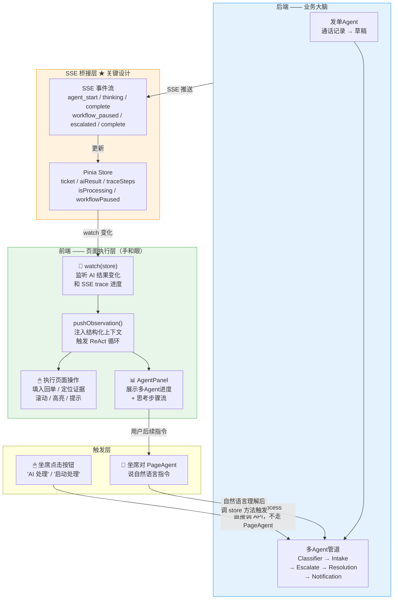
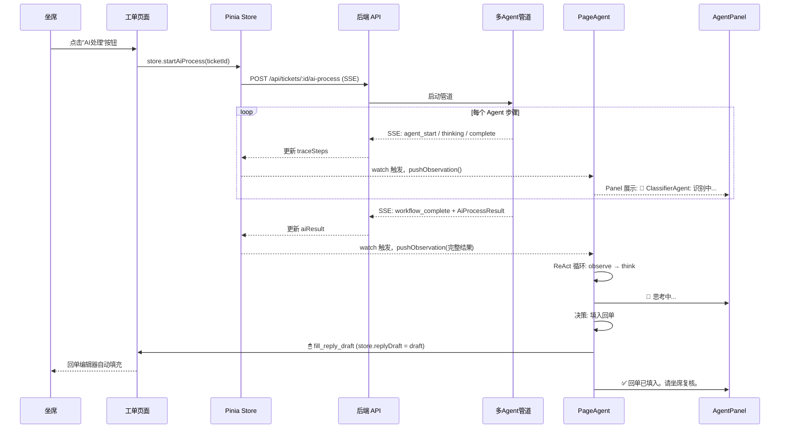
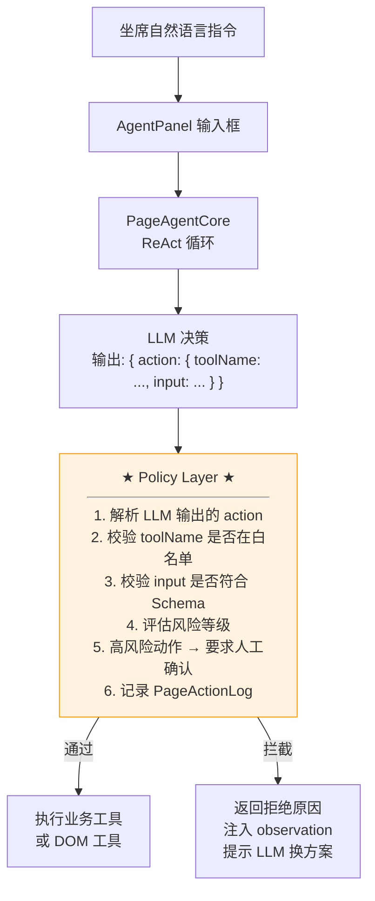

# PageAgent 升级方案

> 将 PageAgent 从"坐席动作栏"升级为贯穿全流程的可视化页面执行引擎。基于 Ali page-agent 的源码裁剪接入，配备 TicketAgent Policy Layer（硬约束），并消除"AI 点 AI"的套娃问题。

---

## 一、背景与目标

### 1.1 当前状态

PageAgent 当前实现是 `PageAssistantPanel.vue`（175 行 Vue 组件）：
- **被动动作栏**：根据后端多 Agent 管道的 `AiProcessResult` 展示 5 个按钮
- **纯前端组件**：不参与 Agent 编排，不做 DOM 自动操作
- **无演示效果**：无鼠标动画、无思考过程展示、无对话面板

### 1.2 升级目标

```text
升级前:  PageAssistantPanel.vue（175行的被动动作栏）
        定位: "后端 Agent 结果的 UI 渲染层"
        交互: 5 个按钮，点击触发
        视觉: 无动画，无过程展示

升级后:  基于 Ali page-agent 源码裁剪的全流程页面执行引擎
        定位: "贯穿全流程的可视化操作者"
        交互: 自然语言对话 + 鼠标自动点击动画 + 右侧 Agent 面板
        视觉: 可见的鼠标移动、点击高亮、步骤文字流、思考过程
```

---

## 二、接入方案选择：裁剪源码（npm 依赖方案）

### 2.1 两种方案对比

| 维度 | 方案 A：npm 依赖 + customTools | 方案 B：裁剪源码接入（选中） |
|---|---|---|
| **接入方式** | `npm install page-agent` → `import { PageAgent }` | 从 `page-agent-main` 裁剪核心代码到 `frontend/src/page-agent/` |
| **接入成本** | 极低（2 行 import + 200 行工厂函数） | 中等（需理解源码结构后裁剪，但不重写） |
| **定制深度** | 只能改 customTools / instructions / transformPageContent | **完全控制**：Panel 样式、鼠标动画参数、工具白名单硬编码 |
| **Policy Layer** | 软约束（通过 instructions 文本约束 LLM） | **硬约束**（代码级白名单校验，LLM 根本拿不到危险工具） |
| **Panel UI 改造** | 只能 CSS 覆盖，DOM 结构不可改 | Panel 源码在手里，可以完全重做 |
| **升级风险** | page-agent 发新版本可能 break | 无外部依赖，不受影响 |
| **代码可读性** | 核心逻辑在黑盒里 | 全部在自己仓库，可调试 |
| **对答辩的影响** | "调研了 page-agent，基于 customTools 机制集成" | **"深入 page-agent 源码，裁剪核心引擎，自建金融策略层"** |

### 2.2 为什么选方案 B

**核心原因：Policy Layer 需要硬约束。**

方案 A 中，你通过 `instructions.system` 文本告诉 LLM "禁止执行 JavaScript"——这是**软约束**，LLM 可能不遵守（prompt injection、幻觉等）。金融工单系统需要代码级保证。

```typescript
// 方案 A：软约束（LLM 可以不遵守）
instructions: { system: "禁止执行 JavaScript。" }

// 方案 B：硬约束（代码层面根本不给 LLM 这个选项）
// frontend/src/page-agent/tools/ 目录下直接不包含 execute_javascript 的实现
// 即使 LLM 输出了 { action: { execute_javascript: ... } }
// Policy Layer 会拦截并返回错误，根本不执行
```

**次要原因**：Panel 样式、鼠标动画速度、遮罩颜色等视觉元素需要对 TicketAgent 设计语言适配，npm 包无法满足。

### 2.3 裁剪范围

```text
page-agent-main/packages/
├── core/
│   └── src/
│       ├── PageAgentCore.ts          ✅ 裁剪：ReAct 循环引擎（~660行）
│       ├── prompts/                  ✅ 裁剪：系统提示词模板
│       ├── tools/index.ts            🔧 重写：替换为 TicketAgent 业务工具
│       └── types.ts                  ✅ 裁剪：类型定义
├── page-controller/
│   └── src/
│       ├── PageController.ts         ✅ 裁剪：DOM 操作层
│       ├── SimulatorMask.ts          ✅ 裁剪：可见鼠标 + 遮罩动画
│       └── browser-state.ts          ✅ 裁剪：DOM 脱水（转文本索引）
├── ui/
│   └── src/
│       └── Panel.ts                  🔧 改造：自定义 Panel 样式 + 集成 SSE 进度
├── llms/
│   └── src/
│       └── LLM.ts                    ✅ 裁剪：LLM 调用封装（OpenAI 兼容接口）
│
├── extension/                        ❌ 不引入（单页面场景不需要）
├── mcp/                              ❌ 不引入
└── website/                          ❌ 不引入
```

**目标目录结构**：

```text
frontend/src/page-agent/
├── core/
│   ├── PageAgentCore.ts              # 裁剪自 page-agent，保持 ReAct 循环
│   ├── prompts.ts                    # 裁剪自 page-agent 的系统提示词
│   └── types.ts                      # 类型定义
├── controller/
│   ├── PageController.ts             # 裁剪自 page-agent，DOM 操作
│   ├── SimulatorMask.ts              # 裁剪自 page-agent，鼠标动画
│   └── browserState.ts              # DOM 脱水
├── llm/
│   └── LLMClient.ts                  # LLM 调用封装（走 /api/llm/proxy）
├── tools/
│   ├── index.ts                      # 工具注册表（只注册我们允许的工具）
│   ├── dom-tools.ts                  # 裁剪的量 DOM 工具（仅 scroll, wait, click）
│   └── business-tools.ts             # TicketAgent 业务工具
├── policy/
│   ├── PolicyLayer.ts               # ★ 核心新增：PageBusinessContext → PageTaskPlan
│   └── validators.ts                 # 动作白名单校验、风险评估
├── panel/
│   └── AgentPanel.vue                # 改造的 Panel UI（Vue 组件版本）
└── index.ts                          # createTicketPageAgent() 工厂函数
```

---

## 三、架构设计：消除"AI 点 AI"

### 3.1 核心问题

如果在 PageAgent 的工具集中包含 `start_ai_process`（触发后端多 Agent 管道），会导致：

```text
❌ 不自然的套娃:
  坐席: "处理这张工单"
  → PageAgent(LLM) 决策: "需要启动 AI 处理"
  → PageAgent 调用 start_ai_process 工具
  → 后端 5 个 Agent(LLM) 依次执行
  → PageAgent 拿到结果，继续操作

  观众会问: "两个 AI 之间为什么要通过点按钮来通信？为什么不直接调？"
```

### 3.2 正确的职责分离



**关键设计决策**：

| 设计决策 | 说明 |
|---|---|
| **多Agent管道不经过PageAgent触发** | 坐席点按钮 → `store.startAiProcess()` → 直接调 API。PageAgent 不持有 `start_ai_process` 工具 |
| **PageAgent 通过 watch 感知结果** | `watch(store.aiResult)` + `watch(store.traceSteps)` → `pushObservation()` → 触发 ReAct 循环 |
| **PageAgent 只做页面操作** | 填入回单、定位证据、高亮缺失字段、滚动页面、展示进度——真正的 GUI 操作 |
| **Panel 展示后端 Agent 进度** | SSE trace → store → Panel 实时渲染 "ClassifierAgent: 识别为优惠券补发 (2.1s)" |

### 3.3 修正后的工具集

```typescript
// ════════════════════════════════════════════════════════
// 核心变化：移除了 start_ai_process 工具
// PageAgent 不触发多Agent管道，只响应管道结果
// ════════════════════════════════════════════════════════

// 发单侧工具（3个）
const ticketTools = {
  open_ticket_form:    tool({ /* 打开发单表单 */ }),
  fill_ticket_field:   tool({ /* 填写指定字段 */ }),
  submit_ticket:       tool({ /* 提交工单 */ }),
}

// 回单侧工具（3个，而不是4个 —— 移除了 start_ai_process）
const replyTools = {
  get_ticket_context:  tool({ /* 获取工单 + AI 结果上下文 */ }),
  fill_reply_draft:    tool({ /* 将 AI 回单填入编辑器 */ }),
  scroll_to_section:   tool({ /* 滚动到指定区域 */ }),
}

// PageAgent 不再拥有触发 AI 处理的能力
// AI 处理由坐席点击按钮或页面加载时的自动逻辑触发
```

---

## 四、SSE 桥接层：PageAgent 如何感知后端进度

### 4.1 核心代码

```typescript
// frontend/src/page-agent/bridge.ts
// ★ 这是连接后端 Agent 和前端 PageAgent 的关键代码

import { watch } from 'vue'
import type { PageAgentCore } from './core/PageAgentCore'
import { useTicketStore } from '@/stores/ticket'

/**
 * 建立 Pinia Store → PageAgent 的观察桥接。
 * 当后端多Agent管道的 SSE 事件更新 store 时，
 * 自动向 PageAgent 注入 observation，触发其 ReAct 循环。
 */
export function connectStoreToPageAgent(agent: PageAgentCore) {
  const store = useTicketStore()

  // ── 监听 AI 处理结果（管道完成时触发） ──
  watch(
    () => store.aiResult,
    (newResult, oldResult) => {
      // 只在首次获得结果时注入（避免重复触发）
      if (!newResult || oldResult) return

      agent.pushObservation(
        [
          '═══ 后端多Agent管道已完成 ═══',
          `场景识别: ${newResult.intent?.label || '未知'}`,
          `风险判定: ${newResult.riskDecision || '无'}`,
          `缺失字段: ${newResult.missingFields?.length ? newResult.missingFields.join('、') : '无'}`,
          `工具证据: ${newResult.toolEvidence || '无'}`,
          `回单草稿: ${newResult.replyDraft ? `已生成（${newResult.replyDraft.length}字）` : '未生成'}`,
          `是否可结案: ${newResult.notification?.closureSuggestion?.canClose ? '是' : '否'}`,
          '',
          '请检查以上结果。如有回单草稿，可调用 fill_reply_draft 填入编辑器。',
          '如有缺失字段，告知坐席需要补充的内容。',
        ].join('\n')
      )
    }
  )

  // ── 监听 SSE trace 步骤（实时展示进度） ──
  watch(
    () => store.traceSteps,
    (steps) => {
      if (!steps || steps.length === 0) return
      const lastStep = steps[steps.length - 1]

      // 为每个新建的 trace step 注入 observation
      const stepKey = `${lastStep.agentId}-${lastStep.status}`
      if (stepKey === agent._lastTraceKey) return  // 去重
      agent._lastTraceKey = stepKey

      const emoji = lastStep.status === 'RUNNING' ? '🔄' :
                    lastStep.status === 'SUCCESS' ? '✅' :
                    lastStep.status === 'FAILED' ? '❌' : '⏳'

      agent.pushObservation(
        `${emoji} ${lastStep.agent}: ${lastStep.summary}`
      )
    },
    { deep: true }
  )

  // ── 监听处理状态 ──
  watch(
    () => store.isProcessing,
    (processing, wasProcessing) => {
      if (wasProcessing && !processing) {
        // 处理刚结束
        agent.pushObservation('后端处理流程已结束。通过 get_ticket_context 获取最新状态。')
      }
    }
  )

  // ── 监听人工确认暂停 ──
  watch(
    () => store.workflowPaused,
    (paused) => {
      if (paused) {
        agent.pushObservation(
          '⚠️ 流程已暂停，需要人工确认。请告知坐席查看确认对话框。'
        )
      }
    }
  )
}
```

### 4.2 数据流时序



---

## 五、Policy Layer 设计（方案 B 独特优势）

### 5.1 Policy Layer 的位置



### 5.2 Policy Layer 核心逻辑

```typescript
// frontend/src/page-agent/policy/PolicyLayer.ts

import type { PageBusinessContext, PageTaskPlan, PageActionAllowance } from './types'

/**
 * TicketAgent Policy Layer —— 代码级硬约束。
 * 在 LLM 决策后、工具执行前进行拦截校验。
 */
export class TicketAgentPolicy {
  constructor(
    private ctx: PageBusinessContext,     // 当前业务上下文
    private allowlist: Set<string>,       // 允许的工具白名单
    private demoMode: boolean             // Demo 模式：低风险可自动提交
  ) {}

  /**
   * 校验 LLM 输出的 action 是否可以执行。
   * 返回 { allowed, reason, requiresConfirm }
   */
  validate(action: { toolName: string; input: unknown }): PageActionAllowance {
    // ── 硬约束 1：工具必须在白名单中 ──
    if (!this.allowlist.has(action.toolName)) {
      return {
        allowed: false,
        reason: `工具 "${action.toolName}" 不在 TicketAgent 允许列表中。`,
        requiresConfirm: false,
      }
    }

    // ── 硬约束 2：禁止操作注入 ──
    // 即使 LLM 以某种方式构造了 execute_javascript，也直接拒绝
    const BLOCKED = ['execute_javascript', 'eval', 'new Function']
    if (BLOCKED.some(k => JSON.stringify(action.input).includes(k))) {
      return { allowed: false, reason: '禁止执行动态代码。', requiresConfirm: false }
    }

    // ── 硬约束 3：提交类操作需检查工单状态 ──
    if (action.toolName === 'submit_ticket') {
      if (this.ctx.ticketStatus === 'closed') {
        return { allowed: false, reason: '工单已结案，不允许提交。', requiresConfirm: false }
      }
    }

    // ── 风险感知 ──
    if (this.ctx.riskLevel === 'high') {
      return {
        allowed: true,
        reason: '',
        requiresConfirm: true,  // 高风险工单的任何操作都需要人工确认
      }
    }

    return { allowed: true, reason: '', requiresConfirm: false }
  }

  /**
   * 将业务上下文 + 坐席指令转为结构化的页面任务计划。
   * 这份计划会注入到 PageAgent 的 instructions 中。
   */
  buildTaskPlan(userInstruction: string): PageTaskPlan {
    return {
      goal: userInstruction,
      context: this.ctx,
      allowedTools: Array.from(this.allowlist),
      riskLevel: this.ctx.riskLevel,
      maxSteps: this.ctx.riskLevel === 'high' ? 5 : 15,
      autoSubmit: this.demoMode && this.ctx.riskLevel === 'low',
    }
  }
}
```

---

## 六、演示流程设计（修正版）

### Demo 场景 1：发单侧 —— 完整可见填单

```text
背景: 坐席选择了一段通话记录，右侧已有发单Agent生成的草稿

坐席对 PageAgent 说: "根据通话记录帮我发单"

═══════════════════════════════════════════
PageAgent 可见执行过程:
═══════════════════════════════════════════

📋 Step 1: 观察页面
   🧠 思考中...
   👀 观察: 检测到当前在通话记录页面，右侧草稿区已显示字段
   💡 决策: 打开发单表单，逐字段填入
   🖱 点击"新建工单"  ← 鼠标移动动画 + 按钮高亮
   ✅ 发单表单已打开（320ms）

📋 Step 2-5: 填入字段
   🧠 从草稿区读取提取的字段
   🖱 fill_ticket_field(customerName, "王小明")  ← 表单中客户名输入框高亮
   🖱 fill_ticket_field(phone, "138****6789")
   🖱 fill_ticket_field(scene, "优惠券补发")
   🖱 fill_ticket_field(title, "618活动达标，50元优惠券未到账")
   （每步约 400ms，鼠标在输入框之间移动）

📋 Step 6: 提交
   🧠 检查必填字段：title ✅ | content ✅
   💡 决策: 低风险场景，字段完整，提交工单
   🖱 点击"提交"按钮  ← 按钮波纹动画
   ✅ 工单 T20260722143001 创建成功！

📋 Step 7: 完成
   💬 "工单已创建，编号 T20260722143001。
       页面将跳转到工单详情。到达后如需处理，请点击页面上方'AI处理'按钮。"
═══════════════════════════════════════════

总耗时: ~10 秒
PageAgent 做的事: 导航 → 填表 → 提交（纯页面操作）
发单Agent 做的事: 通话记录 → 场景 + 字段提取（在草稿区，坐席可直接看到）
```

### Demo 场景 2：回单侧 —— 处理与填回单分离

```text
背景: 工单详情页已打开，坐席点击了"AI处理"按钮

═══════════════════════════════════════════
流程分为两段：
  [A] 坐席点击 → 后端管道执行 → Panel 实时展示进度
  [B] 管道完成 → PageAgent 自动感知 → 执行回单操作
═══════════════════════════════════════════

── [A] 坐席点击"AI处理"（不走 PageAgent） ──

🖱 坐席点击页面顶部"启动 AI 辅助"按钮
   → store.startAiProcess(ticketId)
   → POST /api/tickets/:id/ai-process (SSE)

Panel 实时展示后端进度:
   🔄 ClassifierAgent: 正在分析工单内容...
   ✅ ClassifierAgent: 已识别为优惠券补发场景（置信度 95%）
   🔄 IntakeAgent: 正在提取字段...
   ✅ IntakeAgent: 已提取 3/3 个有效字段
   🔄 EscalationAgent: 正在进行风险校验...
   ✅ EscalationAgent: 低风险，必填字段完整，自动处理可继续
   🔄 ResolutionAgent: 正在选择业务工具...
   ✅ ResolutionAgent: 已选择工具 coupon.reissue
   🔄 NotificationAgent: 正在生成回单草稿...
   ✅ NotificationAgent: 已生成回单草稿（186字）

── [B] PageAgent 自动感知并执行（watch 触发） ──

📋 PageAgent ReAct 循环启动:
   👀 检测到 store.aiResult 已更新
   📋 上下文注入:
      "后端多Agent管道已完成
       场景: 优惠券补发 | 风险: 低
       回单草稿: 已生成（186字）
       是否可结案: 是
       请检查并执行后续操作。"

   🧠 思考中...
   💡 决策: 有回单草稿且可结案。填入编辑器，提示坐席复核。
   🖱 fill_reply_draft  →  回单编辑器自动填充
   📜 scroll_to_section('reply-review')  →  平滑滚动到复核区
   ✅ 回单已填入（186字）

   💬 "回单已填入编辑器。字段完整、低风险、可结案。
       请坐席复核回单内容，确认无误后点击'结案'按钮。"
═══════════════════════════════════════════

总耗时: ~15 秒（A段 ~9秒管道执行 + B段 ~6秒 PageAgent 操作）
关键: PageAgent 没有"点击AI处理"——它只做了"填入回单+滚动"
```

---

## 七、与 task_plan.md 模块 M 的对齐

本方案完全对齐 `task_plan.md` 模块 M 的要求：

| task_plan M 要求 | 本方案对应 |
|---|---|
| **M0**: 裁剪源码接入，复用 PageAgentCore / PageController / SimulatorMask | ✅ 第二章：裁剪范围明确，目标目录清晰 |
| **M0**: 不引入完整 monorepo / Extension / MCP | ✅ 裁剪范围中明确排除 extension / mcp / website |
| **M0**: 放入 `frontend/src/page-agent/` | ✅ 第三章目录结构 |
| **M2**: TicketAgent Policy Layer | ✅ 第五章：代码级硬约束，白名单校验 |
| **M2**: `PageBusinessContext` → `PageTaskPlan` | ✅ Policy Layer 的 buildTaskPlan() |
| **M2**: 禁用 execute_javascript | ✅ 硬约束：Policy Layer 中直接拒绝 |
| **M3**: 发单 Agent 与 PageAgent 分离职责 | ✅ 发单 Agent 生成草稿，PageAgent 填表提交 |
| **M4**: 回单侧 PageAgent 不替代五 Agent | ✅ PageAgent 不触发 AI 处理，只做页面操作 |
| **M5**: 右侧控制台 + 可见鼠标 + 动作轨迹 | ✅ Panel + SimulatorMask 裁剪接入 |
| **M5**: activity / history 步骤展示 | ✅ SSE bridge → watch → pushObservation → Panel |
| **M6**: PageActionLog 审计 | ✅ Policy Layer 中每个 action 记录日志 |

---

## 八、任务拆解（截止 7.23 周四）

| 优先级 | 任务 | 预估 | 产出 |
|---|---|---|---|
| **P0** | M0: 裁剪 page-agent 核心代码到 `frontend/src/page-agent/` | 3h | PageAgentCore + PageController + SimulatorMask 可运行 |
| **P0** | M2: 实现 Policy Layer（白名单校验 + 硬约束） | 2h | `policy/PolicyLayer.ts` + `policy/validators.ts` |
| **P0** | M5: 改造 AgentPanel（Vue 版本 + SSE 进度集成） | 2h | 右侧面板可见，对话可用 |
| **P0** | 实现工具集（发单 3 个 + 回单 3 个，不含 start_ai_process） | 2h | 6 个业务工具 + 2 个 DOM 工具（scroll, wait） |
| **P1** | SSE 桥接层：watch store → pushObservation | 1.5h | `bridge.ts` 完成，PageAgent 自动感知管道结果 |
| **P1** | M3: 发单侧完整链路（发单Agent草稿 → PageAgent填表 → 提交） | 2h | 可演示发单全流程 |
| **P1** | M4: 回单侧完整链路（按钮触发管道 → Panel展示 → PageAgent填回单） | 2h | 可演示回单全流程 |
| **P2** | 调优演示效果：stepDelay、鼠标速度、动画参数 | 1.5h | 演示流畅，视觉效果达标 |
| **P2** | Demo 脚本 + PPT | 2h | 两条演示链路准备完毕 |

---

## 九、已知问题与待优化点

| 问题 | 影响 | 优化方向 |
|---|---|---|
| **Vue 重渲染导致 DOM index 漂移** | 内置 click 工具可能点到错误元素 | 优先用业务工具（store 操作），DOM 工具仅保留 scroll |
| **裁剪代码的维护成本** | Ali page-agent 上游更新后需手动合并 | 裁剪时保留原始版权注释 + MIT License + 来源说明；核心循环（ReAct）变动频率低 |
| **Panel UI 需从零改造** | 裁剪后 Panel 不是开箱即用的 React 组件，需转为 Vue | 参考原 Panel 的 DOM 结构和 CSS，用 Vue 重写（工作量可控，~200 行） |
| **LLM 调用成本** | PageAgent 每步调一次 LLM，演示中约 5-8 步 | 演示环境可用 demo 免费 API；生产环境可加缓存或降级为规则路由 |
| **没有页面操作审计持久化** | PageActionLog 只在内存中，刷新丢失 | 后续加 `page_action_log` 表持久化 |
| **transformPageContent 脱敏** | 业务工具不经过 DOM，脱敏需手动在返回值中处理 | 当前 demo 数据为构造数据，无真实客户信息 |

---

## 十、技术选型故事（答辩用）

```text
问题: 多Agent后端的处理结果如何转化为坐席的实际页面操作与演示效果？

调研方案:
  A. 手写页面操作逻辑（每个按钮一个事件处理函数）
     → 无 AI 驱动，无演示效果
  B. 引入 browser-use（Python 后端，需 Playwright 环境）
     → 需要后端部署浏览器，太重，不适合前端展示
  C. npm 安装阿里 page-agent，通过 customTools 定制
     → 速度快但定制深度受限，工具白名单是软约束
  D. 裁剪阿里 page-agent 源码 + 自建 Policy Layer ★ 选择

选择 D 的理由:
  1. 保留了 page-agent 最核心的能力: ReAct 循环引擎、DOM 脱水、SimulatorMask 鼠标动画
  2. Policy Layer 提供代码级硬约束（不只是 Prompt 约束），确保金融场景合规
  3. 完全控制 Panel UI、鼠标动画参数，适配 TicketAgent 设计语言
  4. 明确解耦"业务大脑"和"页面执行": 多Agent管道由按钮触发，PageAgent 通过
     SSE 桥接层感知结果，消除"AI点AI"的套娃问题
  5. 零外部运行时依赖，源码在自己仓库，可审计可调试

落地架构:
  - 后端多Agent管道（业务大脑）→ SSE → Pinia Store → watch → PageAgent（页面执行）
  - PageAgent 不触发 AI 处理，只做填表、填入回单、定位证据、滚动等页面操作
  - Policy Layer 对所有工具调用做硬约束校验
  - Panel 实时展示后端Agent进度 + PageAgent 思考过程
```
