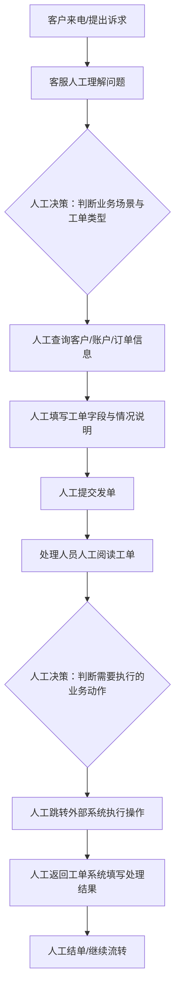
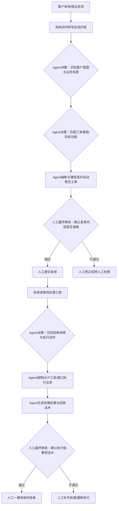

# 工单业务整体流程

## 1. 业务背景

信用卡工单系统是客户问题处理和内部业务协同的核心平台，承担客户诉求接收、问题流转、业务执行、处理结果沉淀等职责。当前系统年处理工单量超过百万件，但整体流程仍以人工操作为主，典型问题包括复制粘贴多、跨系统跳转多、字段填写依赖经验、处理效率不稳定。

从业务流程上看，工单处理可以分为两个核心环节：

- **发单**：根据客户来电或会话内容生成工单，并把问题准确流转到对应处理环节。
- **回单**：处理人员根据工单内容执行实际业务操作，并将处理结果反馈到工单系统完成结单。

## 2. 关键角色与决策节点说明

为了更清晰地体现业务责任，本文将流程中的关键节点分为三类：

- **人工决策节点**：需要人工基于经验、风险判断或异常情况做出决定。
- **Agent决策节点**：由Agent基于会话、工单内容和规则能力自动判断处理路径。
- **人工最终审核节点**：Agent已经完成主要处理，但最终仍需人工确认结果后才能提交或结单。

从整体逻辑上看，Agent介入后的目标不是完全取消人工，而是将人工从高频重复操作中解放出来，保留在高价值、兜底和风险控制环节。

---

## 3. Agent介入前的整体业务流程

### 3.1 发单流程（人工模式）

1. 客服接听客户来电，了解客户诉求。
2. 通话结束后，客服手动整理客户信息和沟通内容，例如手机号、姓名、问题描述等。
3. 客服进入工单系统或相关查询系统，检索客户、账户、订单等信息。
4. 客服根据自己的经验判断客户诉求属于哪一类业务场景，并手动选择对应的工单类型。
5. 客服将会话内容粘贴到“其他情况说明”等文本字段，并手动填写结构化信息。
6. 客服确认信息无误后提交工单，进入后续处理流程。

### 3.2 回单流程（人工模式）

1. 处理人员打开待处理工单，阅读工单内容并理解客户问题。
2. 处理人员判断该工单需要执行什么业务动作，例如补发优惠券、修改地址、核查账单、排查风险等。
3. 处理人员跳转到一个或多个外部业务系统中进行查询或操作，例如反洗钱系统、商户管理系统、优惠券系统等。
4. 完成业务处理后，处理人员返回工单系统。
5. 处理人员手动填写处理结果、处理说明和结论话术。
6. 确认无误后完成回单并结单，必要时继续流转给下一个处理角色。

### 3.3 介入前的主要痛点

- **处理链路长**：从识别问题到提交/结单，步骤多、切换频繁。
- **人工判断成本高**：工单类型选择、字段填写、结果描述都依赖人工经验。
- **跨系统操作繁琐**：回单时需要在多个业务系统间来回跳转。
- **效率和质量不稳定**：容易出现错选工单、漏填字段、描述不一致等问题。
- **处理时长偏高**：单笔工单通常需要约 1 到 2 分钟，难以支撑更高频率的业务处理。

---

## 4. Agent介入后的整体业务流程

Agent介入后的目标，不是简单替代单点操作，而是把“识别问题、选择路径、执行动作、生成结果”串成一条自动化协同链路，让人工角色从“亲自操作”转为“快速复核”。

### 4.1 发单流程（Agent辅助/自动化模式）

1. 客服与客户通话时，系统实时进行语音转写，形成会话文本。
2. **意图识别Agent**对会话内容进行分析，识别客户当前诉求和所属业务场景。
3. **功能找人Agent**根据识别结果，匹配最合适的工单类型或目标功能页面。
4. **自动填充Agent**从会话内容中提取客户基础信息、问题摘要、关键字段，并自动填入工单页面。
5. 客服只需对自动生成结果进行快速复核，必要时做少量修改。
6. 客服点击提交，完成发单。

### 4.2 回单流程（Agent协同执行模式）

1. 系统读取待处理工单内容，并提取客户诉求、上下文和待执行事项。
2. **意图识别Agent**判断当前工单属于哪一类回单场景，以及需要执行什么业务动作。
3. **工具调用Agent（MCP）**不再依赖人工逐个打开外部系统，而是直接调用对应接口或工具完成业务处理，例如补发优惠券、修改地址、查询结果等。
4. **话术生成Agent**根据执行结果自动生成处理说明和面向客户的回单话术。
5. 人工处理人员进行最终审核，确认动作结果和话术内容是否准确。
6. 审核通过后，一键采纳结果并完成结单。

### 4.3 Agent介入后的角色分工

- **意图识别Agent**：负责理解客户诉求或工单内容，确定业务场景。
- **功能找人Agent**：负责找到对应页面、模块或工单类型。
- **自动填充Agent**：负责字段抽取和页面填充。
- **工具调用Agent**：负责通过接口或工具直接执行具体业务动作。
- **话术生成Agent**：负责将处理结果转化为标准化、可复用的回单描述。

---

## 5. 发单与回单流程图

### 5.1 Agent介入前流程图

### 5.2 Agent介入后流程图

### 5.3 流程图解读

- **人工决策节点主要集中在介入前**：人工需要自己理解问题、判断场景、选择工单类型、决定处理动作。
- **Agent决策节点主要集中在介入后中段**：由Agent完成意图识别、路径匹配、动作选择和处理结果生成。
- **人工最终审核节点保留在关键出口**：发单提交前和回单结单前都保留人工确认，确保业务安全和结果可控。

---

## 6. 关键决策责任划分

### 6.1 需要人工决策的节点

- 客户诉求复杂、模糊或存在多重意图，Agent无法稳定判断时。
- 涉及高风险、高争议、强合规场景时，例如风险排查、账单争议、特殊客诉。
- Agent识别结果与上下文不一致，或工具执行结果异常时。
- 需要结合经验做例外判断、特殊审批或跨部门协调时。

### 6.2 由Agent进行决策的节点

- 识别客户诉求对应的业务场景和工单类别。
- 匹配应进入的功能页面、处理链路或工具能力。
- 提取客户基础字段、问题摘要和结构化信息。
- 判断回单应调用哪类接口、工具或系统能力。
- 根据执行结果生成标准化处理说明和回单话术。

### 6.3 需要人工最终审核的节点

- 发单提交前：确认工单类型、客户信息、问题摘要是否准确。
- 回单结单前：确认工具执行结果、处理结论、回复话术是否可直接对客使用。
- 异常兜底时：确认是否转人工、是否升级处理、是否中断自动流程。

---

## 7. Agent介入前后业务变化总结

### 7.1 人工职责变化

- **介入前**：人工既要理解问题，也要负责查找页面、填写字段、跨系统执行、撰写结果。
- **介入后**：人工主要承担复核和兜底职责，从“执行者”转变为“审核者”。

### 7.2 业务流程变化

- **介入前**：流程以人工串联为主，系统之间割裂，处理效率受个人熟练度影响明显。
- **介入后**：流程以多Agent协同为主，识别、填充、执行、生成结果形成闭环，人工只在关键节点确认。

### 7.3 业务价值变化

- 将工单处理从“人工重操作”转为“系统自动处理 + 人工复核”。
- 减少复制粘贴、页面跳转和重复填写。
- 提升工单分类准确率和回单表述一致性。
- 压缩单笔处理时长，目标从约 1 到 2 分钟缩短至约 5 到 10 秒。
- 为后续沉淀标准化流程、评测Agent效果、扩展更多业务场景打下基础。

---

## 8. 一句话概括

在Agent介入前，工单业务本质上是“人工识别 + 人工操作 + 人工回填”的串行流程；在Agent介入后，工单业务将演变为“Agent决策 + Agent执行 + 人工最终审核”的协同闭环流程，从而显著提升处理效率、标准化水平和风险可控性。
